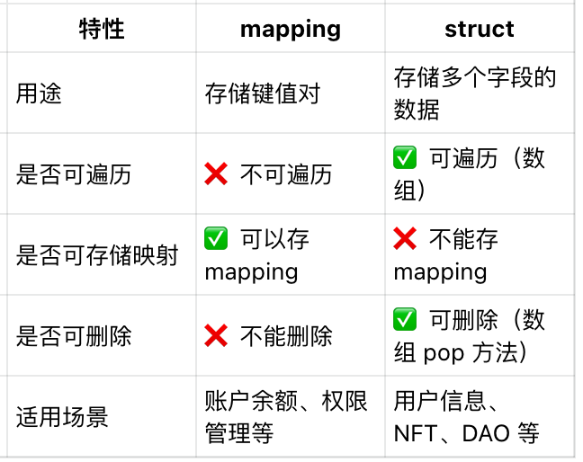

1. 映射（Mapping）
1.1 什么是映射？
映射（Mapping）是 Solidity 中的一种特殊数据结构，类似于哈希表（或字典），用于存储键值对。
语法：
```solidity
mapping(KeyType => ValueType) visibility variableName;
```
- KeyType：键的类型，支持 uint、address、bytes32 等，不支持 struct 或 mapping。
- ValueType：值的类型，可以是任何 Solidity 变量类型，包括 struct 和 mapping。
- visibility：存储变量的可见性，如 public、private 等。
1.2 示例：账户余额存储
```solidity
// SPDX-License-Identifier: MIT
pragma solidity ^0.8.0;
contract BalanceTracker {
    mapping(address => uint256) public balances;
    function setBalance(uint256 amount) public {
        balances[msg.sender] = amount;
    }
    function getBalance(address user) public view returns (uint256) {
        return balances[user];
    }
}
```
- balances 映射 address 到 uint256，用于存储用户的余额。
- setBalance 允许用户设置自己的余额。
- getBalance 获取指定用户的余额。

1.3 多级映射（嵌套映射）
```solidity
contract MultiMapping {
    mapping(address => mapping(string => uint256)) public userBalances;
    function setUserBalance(string memory currency, uint256 amount) public {
        userBalances[msg.sender][currency] = amount;
    }
    function getUserBalance(address user, string memory currency) public view returns (uint256) {
        return userBalances[user][currency];
    }
}
```
- 这里 userBalances 是一个 嵌套映射，存储用户对不同币种的余额。

1.4 映射的特点
- 默认值： 未初始化的映射键会返回 ValueType 的默认值（例如 uint256 默认 0）。
- 不可遍历： Solidity 不支持遍历 mapping，只能通过 key 访问特定 value。
- 可修改但不可删除： 可以修改 mapping 中的值，但不能删除整个 mapping。

2. 结构体（Struct）
2.1 什么是结构体？
结构体（Struct）是一种自定义数据类型，用于存储多个不同类型的数据。
语法：
```solidity
struct StructName {
    DataType1 variable1;
    DataType2 variable2;
    ...
}
```
2.2 示例：用户信息存储
```solidity
contract UserManager {
    struct User {
        string name;
        uint256 age;
        address wallet;
    }
    mapping(address => User) public users;
    function setUser(string memory name, uint256 age) public {
        users[msg.sender] = User(name, age, msg.sender);
    }
    function getUser(address userAddress) public view returns (string memory, uint256, address) {
        User memory user = users[userAddress];
        return (user.name, user.age, user.wallet);
    }
}
```
- User 结构体包含 name、age、wallet 三个字段。
- users 是一个 mapping，将 address 映射到 User 结构体。
- setUser 允许用户存储他们的信息。
- getUser 允许查询用户信息。

2.3 结构体数组
如果要存储多个 User 结构体，可以使用数组：
```solidity
contract UserList {
    struct User {
        string name;
        uint256 age;
    }
    User[] public users;
    function addUser(string memory name, uint256 age) public {
        users.push(User(name, age));
    }
}
```
- users 数组存储 User 结构体。
- addUser 添加新用户。

2.4 结构体的应用场景
- 组织和存储复杂数据
- 结合 mapping 创建去中心化存储
- 用于 NFT、DAO、投票等应用
1. 结合映射和结构体
映射和结构体经常结合使用来构建复杂的数据存储。
示例：去中心化用户管理
```solidity
contract UserRegistry {
    struct User {
        string name;
        uint256 age;
        bool isRegistered;
    }
    mapping(address => User) public users;
    function registerUser(string memory name, uint256 age) public {
        require(!users[msg.sender].isRegistered, "User already registered");
        users[msg.sender] = User(name, age, true);
    }
    function getUser(address user) public view returns (string memory, uint256, bool) {
        require(users[user].isRegistered, "User not registered");
        User memory u = users[user];
        return (u.name, u.age, u.isRegistered);
    }
}
```
- 这里 User 结构体增加了 isRegistered 标志位。
- mapping(address => User) 记录已注册的用户。
- registerUser 确保用户只能注册一次。
- getUser 只允许查询已注册用户的信息。

3. 总结


映射和结构体是 Solidity 合约开发中最重要的数据结构之一，合理结合两者可以构建高效的数据存储模型。