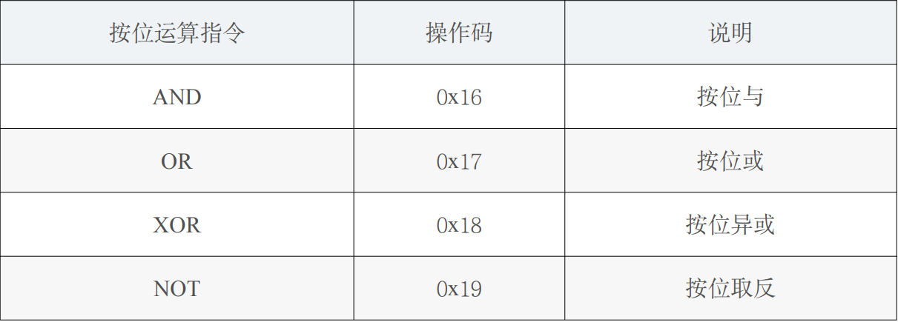
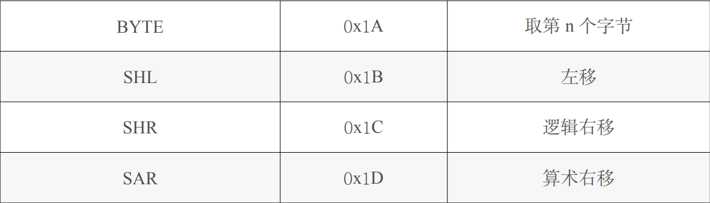
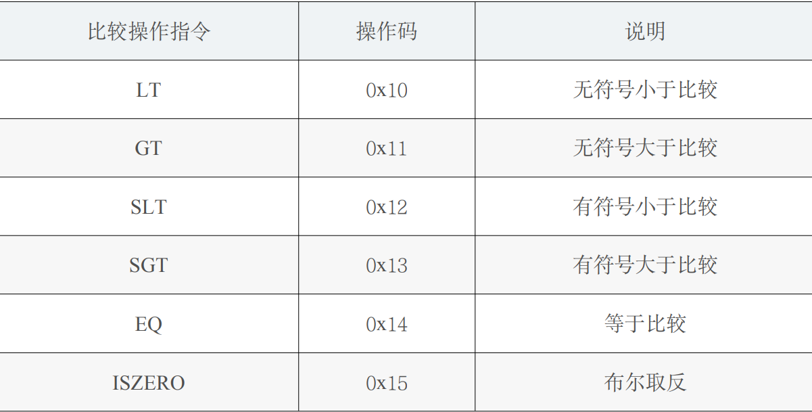

# 以太坊虚拟机 EVM

#### 课程目标

- 深入了解以太坊虚拟机（EVM）的架构及其运作机制
- 掌握 EVM 的数据存储结构和执行模型
- 理解 Gas 消耗、交易处理、合约调用及执行流程
- 掌握 EVM 内存、存储、栈的管理方法及其在智能合约中的应用

#### 课程结构

### 1. **EVM 概述**

- **EVM 是什么？**

  - 以太坊虚拟机（EVM）是一个运行智能合约的去中心化计算环境，负责处理智能合约的部署和执行。它是以太坊协议的一部分，并且独立于外部系统。
- **EVM 的特点**：

  - **独立沙盒环境**：智能合约在 EVM 中执行，没有网络、文件系统或其他进程访问。
  - **图灵完备的状态机**：EVM 是一个“准”图灵完备的状态机，但受限于 Gas 消耗，以防止无限循环执行的问题。

### 2. **EVM 的数据结构**

- **基于栈的架构**：EVM 使用栈来存储数据，最大支持 1024 个栈元素，每个元素是 256 位的字（word），所有计算都在栈上完成。
- **三类存储结构**：

  1. **程序代码存储区（ROM）**：不可变，存储智能合约的字节码。
  2. **内存（Memory）**：可变，临时存储执行期间的数据，随调用结束而清除。
  3. **存储（Storage）**：持久化存储，每个智能合约都有一个唯一的存储区，存储合约状态。

### 3. **账户类型**

- **外部账户（EOA）**：由用户控制，通过私钥签名交易。
- **合约账户**：存储智能合约代码，由合约代码控制其行为。
- **地址空间共享**：外部账户和合约账户共享相同的地址空间。外部账户通过公钥生成地址，合约账户通过 nonce 和创建者的地址生成地址。

### 4. **交易与合约调用**

- **交易的定义**：交易是一个账户与另一个账户之间的信息交换，可以包含二进制数据（payload）或以太币（Ether）。
- **交易执行的过程**：

  - 如果目标账户为合约，EVM 会执行合约代码，并将输入数据作为参数传递。
  - 如果目标账户不存在，交易将创建一个新合约，将代码部署到该合约地址。
- **合约调用与消息传递**：EVM 内部使用消息调用来实现合约间的通信，类似于外部交易。每次调用会携带 Gas 限制，以避免 Gas 消耗殆尽导致调用失败。

### 5. **Gas 机制**

- **Gas 的作用**：

  - 防止计算资源滥用，确保交易的执行不会陷入无限循环。
  - 交易发起者需支付 Gas，执行时消耗的 Gas 根据指令复杂度确定。
- **Gas 价格和限制**：

  - 发起交易时设定 Gas 价格和 Gas 上限。若 Gas 消耗超出设定的上限，交易会触发 out-of-gas 异常，导致状态回滚。
- **Gas 费用计算**：每个指令有对应的 Gas 消耗，复杂度越高，消耗越大。

### 6. **存储、内存与栈**

- **存储（Storage）**：

  - 每个合约都有一个持久化的存储区，是 256 位的 key-value 键值对。
  - 存储操作成本高，读取和写入的 Gas 消耗较大。
- **内存（Memory）**：

  - 在每次调用中重新初始化的可变区域，用于临时存储。
  - 按字节地址访问，内存的扩展需要支付额外的 Gas，扩展成本随内存增长而增加。
- **栈（Stack）**：

  - EVM 使用栈来管理数据，最多容纳 1024 个 256 位的字。所有运算都在栈上进行，栈顶元素可以交换或复制。

### 7. **EVM 的指令集**

- **基本操作**：

  - EVM 支持 256 位的算术、位运算、逻辑运算、条件跳转等基本指令。
  - **控制流**：合约可以执行条件跳转（JUMP）或非条件跳转，EVM 会校验跳转目标的合法性。
- **区块属性访问**：

  - EVM 指令集允许访问当前区块的属性，如区块号和时间戳，这些信息常用于智能合约逻辑中。

### 8. **消息调用与合约之间的交互**

- **消息调用**：智能合约之间的交互是通过消息调用完成的，调用时可以携带数据和以太币。
- **深度限制**：EVM 限制了消息调用的深度为 1024 层，以避免递归调用陷入无限循环。
- **调用合约的数据传递**：调用数据存储在 `calldata` 中，返回数据存储在主存中。

### 9. **代理调用与库的使用**

- **代理调用（delegatecall）**：允许在调用者的上下文中执行被调用合约的代码，`msg.sender` 和 `msg.value` 不会改变。这种方式允许动态加载外部合约的代码，常用于合约升级和库的实现。

##### **合约调用的四种方式**

- **CALL**：最常用的调用方式，修改被调用者的存储。
- **CALLCODE**：修改调用者的存储，而不是被调用者的存储（不再推荐使用）。
- **DELEGATECALL**：修复了 `CALLCODE` 的问题，调用者保持其上下文环境，`msg.sender` 不变。
- **STATICCALL**：用于调用 `view` 或 `pure` 类型的函数，不允许修改状态。

### 10. **日志与事件**

- **日志（Logs）**：EVM 支持日志记录，日志可以从区块链外部查询，但合约内部无法访问。日志用于智能合约的事件通知。
- **事件**：合约通过 `emit` 关键字触发事件，事件会被记录在区块链的日志中，用于通知外部监听者。

### 11. **合约创建与销毁**

- **合约创建**：通过特殊指令创建新的合约，执行合约代码后，将结果作为合约的代码存储在区块链上。
- **合约销毁（selfdestruct）**：合约通过 `selfdestruct` 操作将其代码和存储从区块链上移除，同时将剩余的以太币发送到指定的地址。
-

## 12.**字节码的执行**

##### EVM 将字节码转换为操作码，依次压入栈进行操作。

EVM 执行的也是字节码。由于操作码被限制在一个字节以内，所以 EVM 指令集最多只能容纳 256 条指令。目前 EVM 已经定义了约 142 条指令，还有 100 多条指令可供以后扩展。这 142 条指令包括算术运算指令，比较操作指令，按位运算指令，密码学计算指令，栈、 memory、storage 操作指令，跳转指令，区块、智能合约相关指令等。本书对其中某些较为重要的指令进行了列举。

##### 12.1 算术运算指令

EVM 总共定义了 11 条算术运算指令，如表所示：

##### 12.2 位移运算指令

EVM 定义了 8 条按位运算指令，如表所示：

##### 12.3 比较操作指令

EVM 定义了 6 条比较操作指令，如表所示：

### 

#### 常见面试问题：

- **1. EVM 与传统虚拟机的区别是什么？**

  - **回答**：EVM 是为去中心化区块链环境设计的虚拟机，不依赖外部系统，独立处理合约执行，防止恶意操作导致无限循环。
- **2. 如何在 EVM 中优化 Gas 消耗？**

  - **回答**：通过减少存储写操作、批量操作、合理的内存扩展和避免复杂的循环来优化 Gas 消耗。
- **3. EVM 如何处理合约之间的调用？**

  - **回答**：EVM 通过消息调用在合约之间进行交互，每个调用都会分配独立的内存空间和 Gas 限制。
