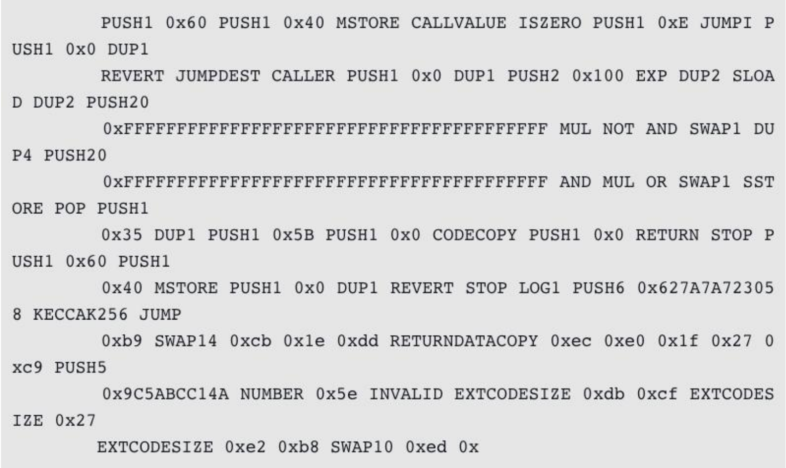

# EVM 工作原理

### 5.2.1 EVM 解释执行流程

以下是以太坊虚拟机业务流程，如图所示：


输入一笔交易，内部会转换成一个 Message 对象，传入 EVM 执行。如果是一笔普通转账交易，那么直接修改 StateDB 中对应的账户余额即可。如果是智能合约的创建或者调用，则通过 EVM 中的解释器加载和执行字节码，执行过程中可能会查询或者修改 StateDB。

**固定油费（Intrinsic Gas） **

每笔交易过来，不管什么情况先需要收取一笔固定油费，计算方法如图所示：如果交易不带额外数据（Payload），比如普通转账，那么需要收取 21000 的油费。


如果交易携带额外数据，那么这部分数据也是需要收费的，具体来说是按字节收费：字节为 0 的收 4 块，字节不为 0 收 68 块，所以很多做合约优化操作目的就是减少数据中不为 0 的字节数量，从而降低油费 gas 消耗。

**生成 Contract 对象 **

交易会被转换成一个 Message 对象传入 EVM，而 EVM 则会根据 Message 生成一个 Contract 对象以便后续执行，如图所示：


可以看到，Contract 中会根据合约地址，从 StateDB 中加载对应的代码，后面就可以送入解释器执行了。另外，执行合约能够消耗的油费有一个上限，就是节点配置的每个区块能够容纳的 GasLimit

**送入解释器执行**

代码跟输入都有了，就可以送入解释器执行了。EVM 是基于栈的虚拟机，解释器中需要操作四大组件，如图所示：

- PC：类似于 CPU 中的 PC 寄存器，指向当前执行的指令
- Stack：执行堆栈，位宽为 256 bits，最大深度为 1024
- Memory：内存空间
- Gas：油费池，耗光邮费则交易执行失败


详细解释执行流程，如图所示：


EVM 的每条指令称为一个 OpCode，占用一个字节，所以指令集最多不超过 256，比如图所示，该图示就是一个示例（PUSH1=0x60, MSTORE=0x52）：


首先 PC 会从合约代码中读取一个 OpCode，然后从一个 JumpTable 中检索出对应的 operation，也就是与其相关联的函数集合。接下来会计算该操作需要消耗的油费，如果油费耗光则执行失败，返回 ErrOutOfGas 错误。如果油费充足，则调用 execute()执行该指令，根据指令类型的不同，会分别对 Stack、Memory 或者 StateDB 进行读写操作。

### 5.2.2 创建合约流程

上面的内容讲述了合约解释执行流程，那么创建合约的流程是怎么样的呢？

如果某一笔交易的 to 地址为 nil，则表明该交易是用于创建智能合约的。

首先需要创建合约地址，采用下面的计算公式：Keccak(RLP(call_addr, nonce))[:12]。也就是说，对交易发起人的地址和 nonce 进行 RLP 编码，再算出 Keccak 哈希值，取后 20 个字节作为该合约的地址。

下一步就是根据合约地址创建对应的 stateObject，然后存储交易中包含的合约代码。该合约的所有状态变化会存储在一个 storage trie 中，最终以 Key-Value 的形式存储到 StateDB 中。代码一经存储则无法改变，而 storage trie 中的内容则是可以通过调用合约进行修改的，比如通过 SSTORE 指令。创建流程如图所示：


### 5.2.3 调用合约流程

那么，EVM 又是怎么知道交易想调用的是合约里的哪个函数呢？前面提到跟合约代码一起送到解释器里的还有一个 Input，而这个 Input 数据是由交易提供的。调用流程如图所示：


Input 数据通常分为两个部分：

- 前面 4 个字节被称为“4-byte signature”，是某个函数签名的 Keccak 哈希值的前 4 个字节，作为该函数的唯一标识。
- 后面跟的就是调用该函数需要提供的参数了，长度不定。 举个例子：在部署完 A 合约后，调用 add(1)对应的 Input 数据是：

`0x87db03b70000000000000000000000000000000000000000000000000000000000000001`

**合约调用合约**

以最简单的 CALL 为例，调用流程如图所示：


可以看到，调用者把调用参数存储在内存中，然后执行 CALL 指令。

CALL 指令执行时会创建新的 Contract 对象，并以内存中的调用参数作为其 Input。解释器会为新合约的执行创建新的 Stack 和 Memory，从而不会破环原合约的执行环境。新合约执行完成后，通过 RETURN 指令把执行结果写入之前指定的内存地址，然后原合约继续向后执行。

**合约的四种调用方式 **

在中大型的项目中，操作者不可能在一个智能合约中实现所有的功能，而且这样也不利于分工合作。一般情况下，操作者会把代码按功能划分到不同的库或者合约中，然后提供接口互相调用。

在 Solidity 中，如果只是为了代码复用，可以把公共代码抽出来，部署到一个 library 中，后面就可以像调用 C 库、Java 库一样使用了。但是 library 中不允许定义任何 storage 类型的变量，这就意味着 library 不能修改合约的状态。如果需要修改合约状态，操作者需要部署一个新的合约，这就涉及到合约调用合约的情况。

合约调用合约有下面 4 种方式：

- CALL
- CALLCODE
- DELEGATECALL
- STATICCALL

**CALL vs. CALLCODE **

CALL 和 CALLCODE 的区别在于：代码执行的上下文环境不同。

具体来说，CALL 修改的是被调用者的 storage，而 CALLCODE 修改的是调用者的 storage。二者的对比如图所示：


**CALLCODE vs. DELEGATECALL **

实际上，可以认为 DELEGATECALL 是 CALLCODE 的一个 bugfix 版本，官方已经不建议使用 CALLCODE 了。

CALLCODE 和 DELEGATECALL 的区别在于：msg.sender 不同。

具体来说，DELEGATECALL 会一直使用原始调用者的地址，而 CALLCODE 不会。二者的对比如图所示：


**STATICCALL **

STATICCALL** **放在这里似乎有滥竽充数之嫌，因为目前 Solidity 中并没有一个 lowlevel API 可以直接调用它，仅仅是计划将来在编译器层面把调用 view 和 pure 类型的函数编译成 STATICCALL 指令。

view 类型的函数表明其不能修改状态变量，而 pure 类型的函数则更加严格，连读取状态变量都不允许。

目前是在编译阶段来检查这一点的，如果不符合规定则会出现编译错误。如果将来换成 STATICCALL 指令，就可以完全在运行时阶段来保证这一点了，操作者可能会看到一个执行失败的交易。

### 5.2.4 Solidity 编译为 EVM 字节码

EVM 指令由很多标准机器码指令组成，包含：

- 算术和位运算逻辑操作
- 执行上下文查询
- 栈、内存和存储访问
- 处理流程操作
- 日志、跳转和其他操作

作为标准字节码操作的补充，EVM 还可以访问账户信息（例如地址和余额）以及区块信息（比如区块号和当前的 gas 价格）。

智能合约在 EVM 的执行，需要先将 Solidity 编译为 EVM 字节码进行执行。有很多方法可以将 Solidity 源代码编译为 EVM 字节码，操作者主要使用命令行程序 solc 进行编译。要查看编译器选项，可以简单地运行如下指令：

`$ solc --help`

通过--opcodes 命令行参数可以简单地生成 Solidity 源代码文件对应的操作码序列。这个操作码序列提供了部分信息（--asm 选项可以产生完整的信息），但已经足够进行后续讨论。例如，编译 Solidity 文件 Example.sol 并将字节码输出到 BytecodeDir 可以通过下列指令完成：

`$ solc -o BytecodeDir --opcodes Example.sol`

或

`$ solc -o BytecodeDir --asm Example.sol`

下列命令则可以为示例程序生成字节码

`$ solc -o BytecodeDir --bin Example.sol`

实际生成的操作码文件依赖于 Solidity 源代码文件中包含的特定合约。这个例子源码文件 Example.sol 中仅包含了一个叫作 example 的合约：

```solidity
pragma solidity0.4.19;
contract example{
address contractOwner;
function example()
contractOwner =msg.sender;
}
}
```

这个合约所做的就是保持一个状态变量，来保存运行这个合约的上一个账户的地址。如果查看 BytecodeDir 目录，会看到操作码文件 example.opcode，它包含了 example 合约的 EVM 操作码指令。用文本编辑器打开 example.opcode 文件，会看到如下内容：



用--asm 选项编译 example，会在 BytecodeDir 目录中产生一个 example.evm 文件。它包含了对 EVM 字节码指令的稍高级一些的描述，并附带了一些有用的注解：


--bin-runtime 选项会产生机器可读的十六进制字节码：


可以使用一些操作码列表来查看细节：


这里有一个 PUSH1 后边紧跟了一个原始字节数据 0x60。这意味着这个 EVM 指令接收一个跟在其后的字节数据作为输入（字面数值）并将这个数据压入栈顶。这里也可以将最大 32 字节的数据压入栈顶，比如：


example.opcode 中的第二个 PUSH1 操作码将 0x40 压入栈顶（先前的 0x60 所使用的数据槽会向下移动一个位置）。

接下来是 MSTORE，这是一个保存内存的操作，也就是将一个值保存到 EVM 的内存中。它接收两个参数，并且像大多数 EVM 操作一样，它会使用栈里的数据来获取它实际使用的参数。每当从栈中弹出一个数据（也就是栈顶的数据槽中的数据），其下的所有数据都会向上移动一个位置。MSTORE 的第一个参数是要保存的数值所应使用的目标地址。对于这个程序，0x40 会从栈顶被移除，并将其作为内存目标地址。第二个参数就是要保存的数值，在这里就是 0x60。当 MSTORE 执行完成之后，栈重新变为空，但这里将数值 0x60（即十进制的 96）保存到了内存地址 0x40 处。

下一个操作码是 CALLVALUE，它是一个环境操作码，会将触发这次执行的消息调用所附带的以太币数量（以 wei 为单位）压入栈顶。
