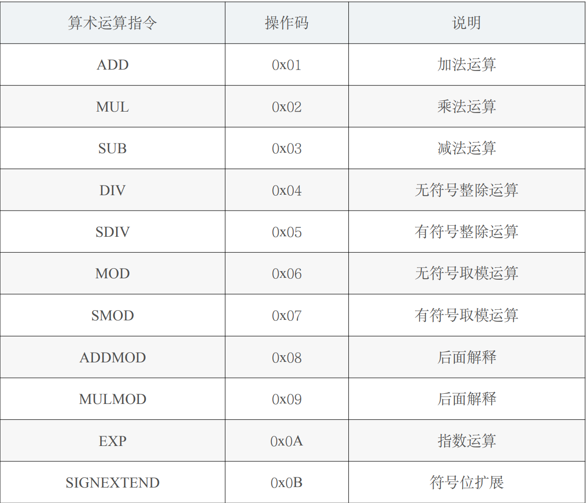

# EVM 指令集

EVM 执行的也是字节码。由于操作码被限制在一个字节以内，所以 EVM 指令集最多只能容纳 256 条指令。目前 EVM 已经定义了约 142 条指令，还有 100 多条指令可供以后扩展。这 142 条指令包括算术运算指令，比较操作指令，按位运算指令，密码学计算指令，栈、 memory、storage 操作指令，跳转指令，区块、智能合约相关指令等。本书对其中某些较为重要的指令进行了列举。

### 5.3.1 算术运算指令

EVM 总共定义了 11 条算术运算指令，如表所示：

### 5.3.2 位移运算指令

EVM 定义了 8 条按位运算指令，如表所示：

### 5.3.3 比较操作指令

EVM 定义了 6 条比较操作指令，如表所示：

