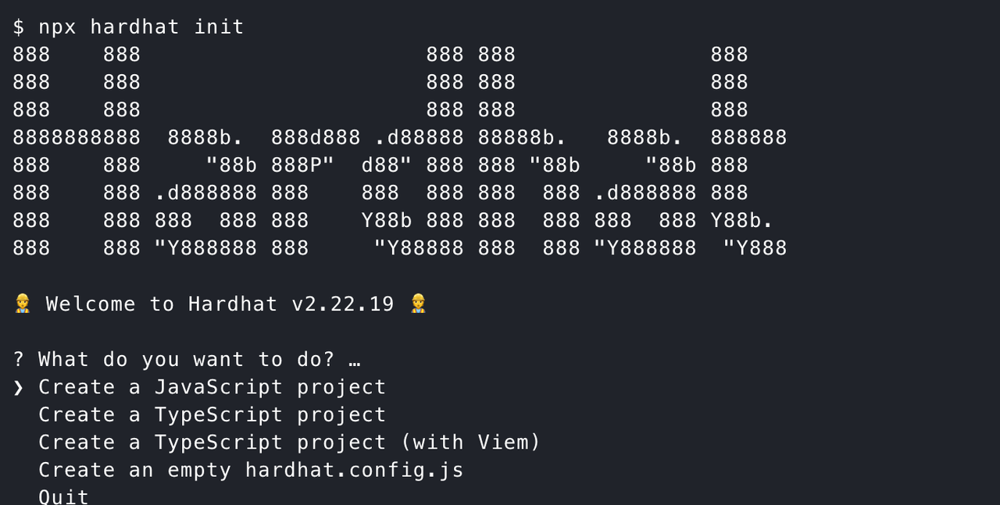

## 环境准备


> 操作系统windows、macos都行，Node版本建议选择 20.16.0 参考文档：处理node环境

Hardhat 官网： https://hardhat.org/

## 开始
首先你要打开终端 分别输入 `node --version` `npm --version`

创建一个 项目的文件夹 名字叫 `projectDir`，linux上面你可以使用 `mkdir yourProjectName` ，windows的话可以直接新建文件夹

然后用 ide (vs 或者 cursor) 打开你创建的 `projectDir` ，输入 `npx hardhat init` 
你会看到如下内容



选择 第一项， 创建一个 js 项目


## 部署到 测试网
主要执行命令称呼 `depolyCmd` 如下
`npx hardhat ignition depoly` 合约部署脚本位置 `--network` 你希望部署的网络
如果你部署过一次，这里会产生缓存
解决的方法是在 前面的  `depolyCmd` 后面 加一个参数 `--reset`
```shell
npx hardhat ignition depoly --network sepolia --reset
```

不过这个hardhat 原有的部署方式在 大部分企业中，其实是 废弃的，不怎么会用的，得考虑到 合约升级这些需求

后面课程 会讲到 用 `hardhat-depoly` 这个插件

## 简单上手

主要是 学习 怎么用 `mocha` 创建测试用例，以及 `chai` 来进行 运行结果断言

一般企业的测试用例，要求我们让合约或者本地测试网络运行到某个**指定状态**去**还原业务场景**，测试我们编写的智能合约运行效果是否满足预期

## 测试 ERC20
ERC20合约代码
```solidity
// SPDX-License-Identifier: MIT
// Compatible with OpenZeppelin Contracts ^5.0.0
pragma solidity ^0.8.22;

import {ERC20} from "@openzeppelin/contracts/token/ERC20/ERC20.sol";
import {ERC20Permit} from "@openzeppelin/contracts/token/ERC20/extensions/ERC20Permit.sol";

contract MyToken is ERC20, ERC20Permit {
    constructor() ERC20("MyToken", "MTK") ERC20Permit("MyToken") {}
}

```

## 课程作业

用 hardhat 部署并测试 `ECR721` 合约

---
后面我们课程会 讲一个 nft 拍卖的项目
