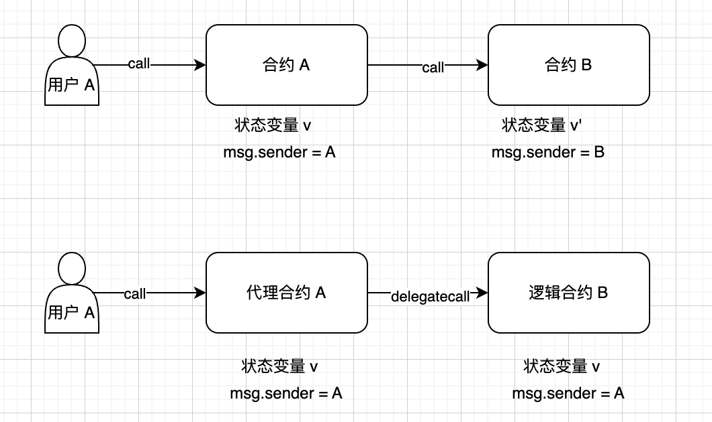
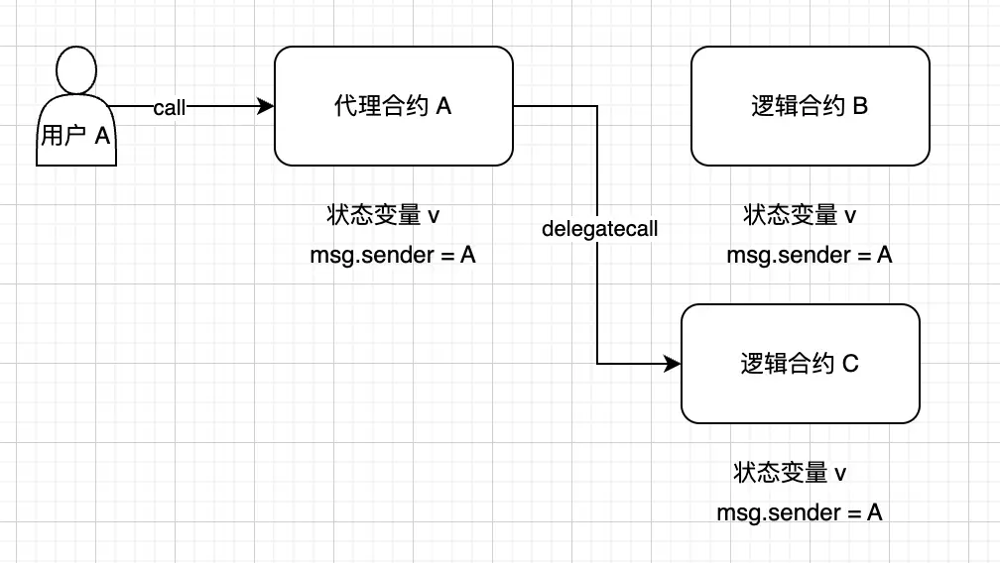
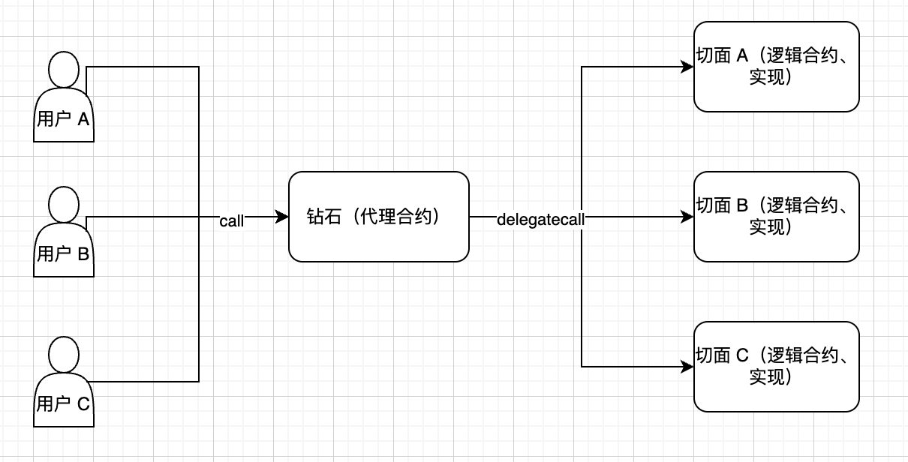
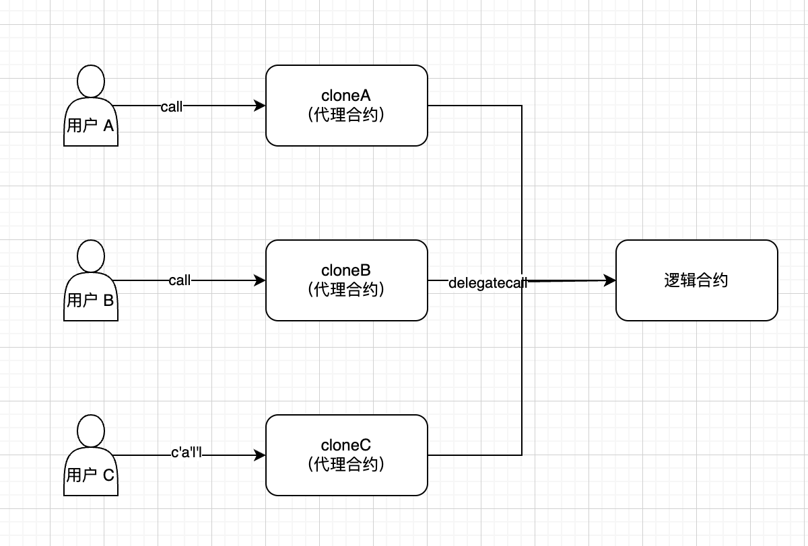
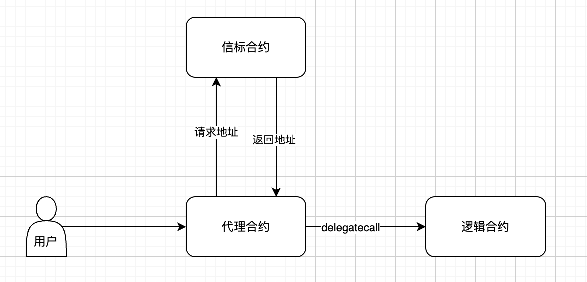
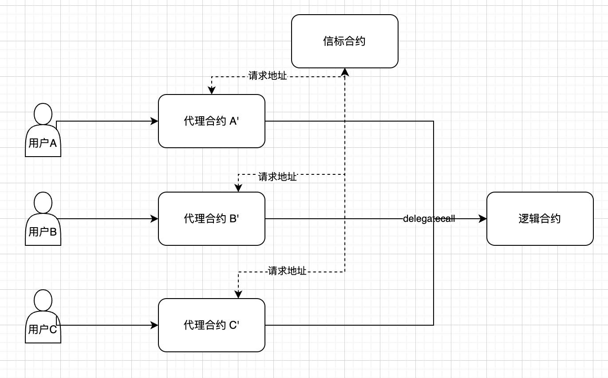
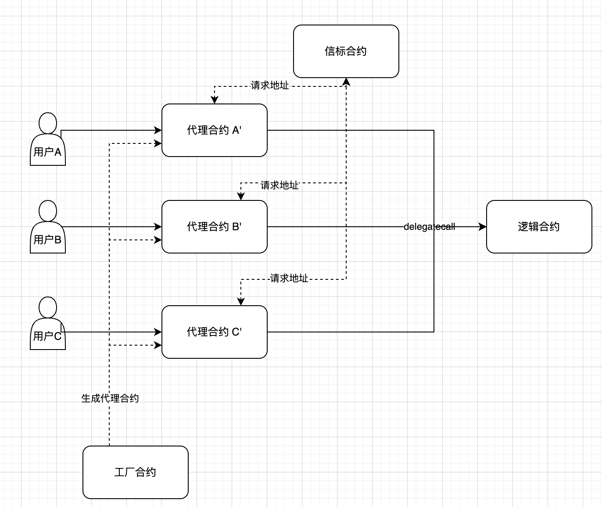
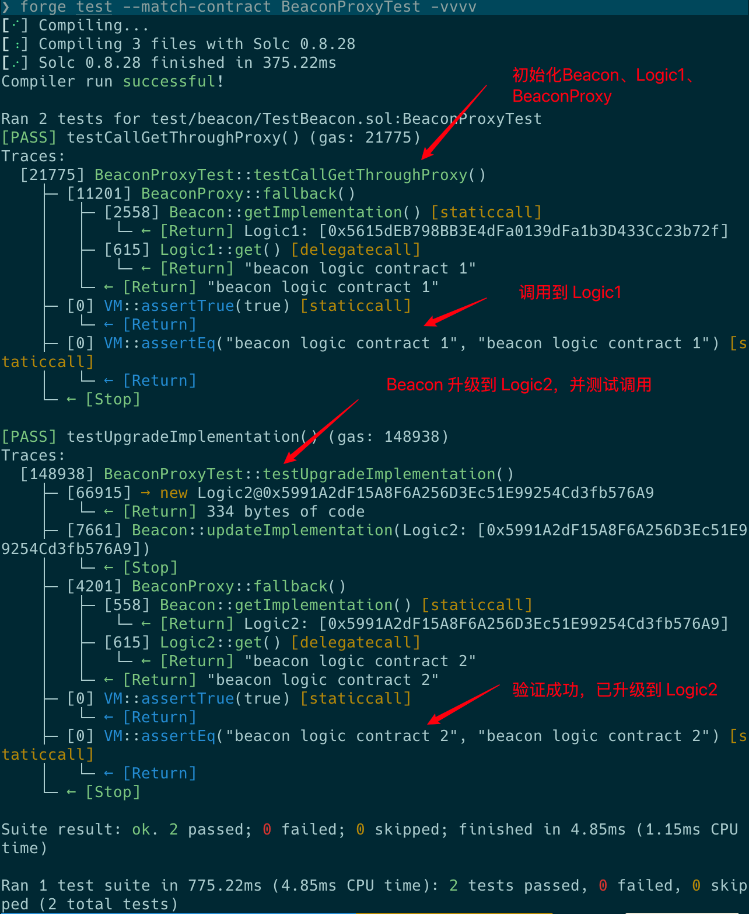

## 信标代理

- **什么是信标代理**

“信标代理”（`Beacon Proxy`）是一种 可升级合约的代理模式，主要特点是通过一个共享的“信标”（`Beacon`）来统一管理逻辑合约地址，适合 **部署多个实例共享同一个逻辑实现** 的场景。

- **代理模式、可升级代理、钻石代理、最小代理回顾**
  - **代理模式**：
    通过 `delegatecall` 命令使得执行行为产生在逻辑合约上，数据变化产生在代理合约上。
    
  - **可升级代理**：
    通过在代理合约中，持有逻辑合约的地址，升级时，改变这个地址的指向。分为透明代理和 `UUPS`。
    
  - **钻石代理**：
    代理合约和逻辑合约是一对多的关系。将代码逻辑分发到不同的逻辑合约中。适合业务拆分。
    
  - **最小代理**：
    又称 `Clone` ，代理合约和逻辑合约是多对一的关系。多个代理合约指向同一个逻辑合约。代理合约的部署 `gas` 费极低。
    
- **信标代理的逻辑图解析**
  
  这是一个最基本的信标代理逻辑图。可以看出，图中的逻辑和普通可升级代理的最大区别就是：新增了个信标合约，代理合约不保存逻辑合约的地址引用，而是转向信标合约获取逻辑合约的引用，动态去调用逻辑合约。
  这样，合约升级的时候就无需在代理合约中调用升级的函数了，转而统一在信标合约中管理升级即可。上面的场景可能还不怎么看得出来信标代理升级管理的优势。那么接下来请看：
  
  在这个场景中，和最小代理模式类似，每个用户有单独的代理合约，而代理合约中，固定保存了信标合约的地址引用。在信标合约中，又保存了逻辑合约的引用。在进行逻辑合约升级时候，传统的透明代理或者 uups 需要我们在代理合约中调用升级函数。在这个例子中，需要调用三次代理合约才能完成更新。而换做信标代理，只需调用一次信标合约中的更新函数即可。大大提高了升级效率，还能节省 gas 费。
  看到这里，可能还有朋友要问了：这么多代理合约，我们是怎么进行生成和管理代理合约的呢？在这里可以进行一个小优化，就是采用工厂合约来进行生成和管理代理合约（本质上就是在工厂合约中 new 出来信标合约、代理合约，并放入一个数组中管理而已)，示例图如下



- 信标代理的特点、应用
  - **统一升级**：在信标合约中保存对逻辑合约的地址引用，升级时无须处理代理合约。只需在信标合约中升级即可。
  - **共享逻辑**：类似最小代理的多对一模式，多个代理合约共享逻辑合约，但数据是隔离的。
  - **钱包部署**：和最小代理类似，适合做钱包的私有化部署，但相比于最小代理而言，多出了统一升级管理的功能。
  - **工厂生成**：和最小代理类似，可以用于 `uniswap` 工厂生成币对的过程，币对之间仅数据不同，逻辑一致。相对于最小代理而言，多出了统一升级管理的功能。

## 信标代理代码实操（非多代理、非工厂合约模式）

这里是手搓实现，生产环境使用应使用 `OZ` 代码库里的

```js
lib/openzeppelin-contracts/contracts/proxy/beacon
```

1. **编写 Logic1.sol**

```js
contract Logic1 {
    string constant BEACONLOGIC = "beacon logic contract 1" ;
    function get() external pure returns(string memory) {
        return BEACONLOGIC;
    }
}
```

1. **编写 Logic2.sol**

```js
contract Logic2 {
    string constant BEACONLOGIC = "beacon logic contract 2" ;
    function get() external pure returns(string memory) {
        return BEACONLOGIC;
    }
}
```

1. **编写 Beacon.sol**

```js
contract Beacon {
    address public implementation;
    address public owner;
    constructor(address impl){
        implementation = impl;
        owner = msg.sender;
    }

//    升级函数
    function updateImplementation(address newImpl) external{
        require(msg.sender == owner, "Not Authorized");
        implementation = newImpl;
    }
// 获取逻辑合约的地址
    function getImplementation() external view returns(address){
        return implementation;
    }
}
```

1. **编写 BeaconProxy.sol**

```js
contract BeaconProxy {
    Beacon public beacon;

//    初始化 proxy，并尝试调用一次 logic
    constructor(Beacon _beacon, bytes memory data){
        beacon = _beacon;
        if(data.length >0){
            (bool success,) = _implementation().delegatecall(data);
            require(success, "Init failed");
        }
    }
//  delegatecall转发
    fallback() external payable{
        _delegate(_implementation());
    }
//  delegatecall转发
    receive() external payable{
        _delegate(_implementation());
    }
// 通过调用 Beacon 合约获取真正的实现地址
    function _implementation() internal view returns(address){
        address impl = beacon.getImplementation();
        require(impl != address(0), "beacon call failed");
        return impl;
    }

//    delegatecall 并用魔法返回 return 值
    function _delegate(address impl) internal{
        assembly {
            calldatacopy(0, 0, calldatasize())
            let result := delegatecall(gas(), impl, 0, calldatasize(), 0, 0)
            returndatacopy(0, 0, returndatasize())

            switch result
            case 0 { revert(0, returndatasize()) }
            default { return(0, returndatasize()) }
        }
    }
}
```

1. **编写测试脚本 TestBeacon.sol**

```js
contract BeaconProxyTest is Test {
    Beacon public beacon;
    BeaconProxy public proxy;
    address public owner;

    Logic1 public logic1;
    Logic2 public logic2;

    function setUp() public {
        owner = address(this);
        // 部署初始逻辑合约
        logic1 = new Logic1();
        // 部署信标
        beacon = new Beacon(address(logic1));
        // 编码初始化调用（可选）
        bytes memory data = abi.encodeWithSignature("get()");
        // 部署代理
        proxy = new BeaconProxy(beacon, data);
    }
//  测试代理调用
    function testCallGetThroughProxy() public {
        // 通过代理合约调用 get()，应该返回 logic1 的内容
        (bool success, bytes memory data) = address(proxy).call(
            abi.encodeWithSignature("get()")
        );

        assertTrue(success);
        string memory result = abi.decode(data, (string));
        assertEq(result, "beacon logic contract 1");
    }
//  升级合约后再尝试代理调用
    function testUpgradeImplementation() public {
        // 部署 logic2
        logic2 = new Logic2();
        // 升级信标指向 logic2
        beacon.updateImplementation(address(logic2));
        // 代理合约调用 get()，应返回 logic2 的内容
        (bool success, bytes memory data) = address(proxy).call(
            abi.encodeWithSignature("get()")
        );
        assertTrue(success);
        string memory result = abi.decode(data, (string));
        assertEq(result, "beacon logic contract 2");
    }
}
```

- **执行测试命令**

```js
forge test --match-contract BeaconProxyTest -vvvv
```

若得到以下结果，测试成功

