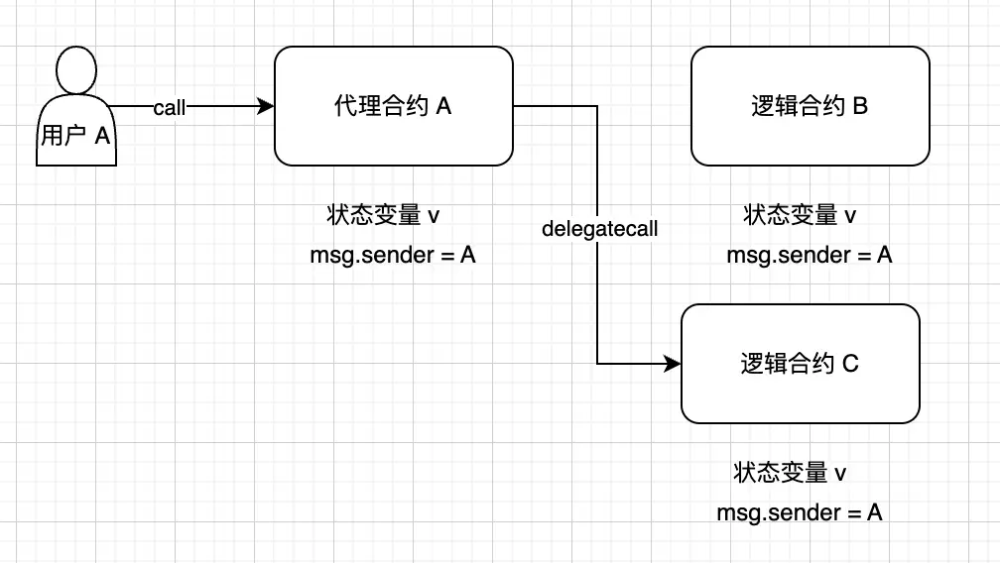
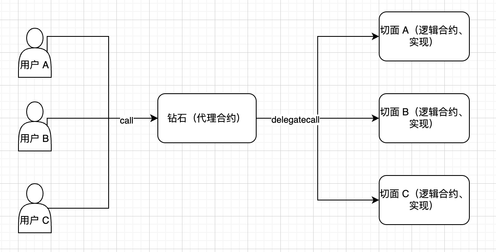
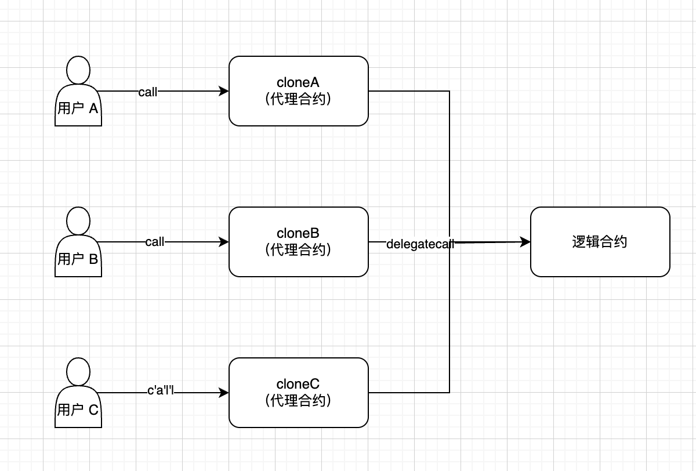

## 钻石代理和最小代理

- **代理合约回顾**

这里我们稍微回顾下代理合约以及合约升级的概念。


- **代理合约**：指合约的交互在` fallckback()` 函数中通过 `delegatecall `来完成合约的调用，数据的变化会反应在代理合约上，而真正执行的逻辑是在逻辑合约上。



- **合约升级**：指在 `Proxy` 合约中，保存对 `Logic` 合约的引用。并且通过在 `Proxy` 合约或 `Logic` 合约中，提供一个方法进行改变这个对 `Logic` 合约的函数，进而达到能够动态改变合约逻辑的目的。

- **钻石代理**
  可以看到，无论是代理合约还是可升级的代理合约，其 `Proxy` 与 `Logic` 合约之间的关系，都是一对一的。而在钻石代理中，`Proxy` 和 `Logic` 之间是一对多的关系。

  我们可知，在以太坊中，一个合约的最大字节码为 `24KB` ，假如我们的业务需求较大，单个合约肯定是不能满足我们的业务需求的。那么，可以采用钻石代理来进行实现。



- 特点
  1. `支持无限拓展`：突破单个合约 `24KB` 的限制
  2. `将逻辑拆分模块`：逻辑直接拆分出不同 `facet`
  3. `可以按需升级`：可以单独针对某个模块进行合约升级
  4. `统一管理`：使用统一的代理合约进行管理逻辑模块
- **钻石（代理合约）**：
  这里简单演示。
  - 钻石代理的原理是：在钻石（代理合约中），使用 `mapping(bytes4 => address)` 来保存要调用的函数选择器对 `Facet` 地址的引用。在调用时，通过 `msg.sig(函数选择器)` 在 `mapping` 中找到需要调用的 `facet` 地址， 然后将 `msg.data(calldata)` 用 `delegatecall` 的方式分发到不同 `facet` 中。
  - 此代码并未加入合约升级逻辑，实际应用应该有合约升级逻辑。
  - `FacetA` 和 `FacetB` 并不保存状态变量（避免插槽冲突，如果需要保存需要确保逻辑合约中和代理合约中顺序和个数一致，可以采用自定义结构体实现）。
  - `fallback()` 理论上不能返回数据，采用内联汇编来强制返回数据。

```js
contract Diamond {
    address public owner;
    // 选择器 => facet 地址
    mapping(bytes4 => address) public facets;
    constructor() {
        owner = msg.sender;
    }
    function setFacet(bytes4 selector, address facet) external {
        require(msg.sender == owner, "Not owner");
        facets[selector] = facet;
    }
    fallback() external payable {
        address facet = facets[msg.sig];
        require(facet != address(0), "Function does not exist");
        (bool success, bytes memory data) = facet.delegatecall(msg.data);
        _return(data);
    }
    // 用内联汇编黑魔法 封装 return 的逻辑（利用 call 函数返回）
    function _return(bytes memory data) internal pure {
        assembly {
            return(add(data, 0x20), mload(data))
        }
    }
}
```

- **切面 A（逻辑合约）**：

```js
contract FacetA {
    function getFacetANum() public view returns (uint) {
        return 1;
    }
}
```

- **切面 B （逻辑合约）**：

```js
contract FacetB {
    function getFacetBMessage() public view returns (string memory) {
        return "hello facetB";
    }
}
```

- **foundry 测试**：

```js
contract DiamondTest is Test {
    Diamond diamond;
    FacetA facetA;
    FacetB facetB;
    function setUp() public {
        diamond = new Diamond();
        facetA = new FacetA();
        facetB = new FacetB();

        // 注册 selector 到 Facet
        diamond.setFacet(FacetA.getFacetANum.selector, address(facetA));
        diamond.setFacet(FacetB.getFacetBMessage.selector, address(facetB));
    }
    function testFacetA() public {
        (bool success2, bytes memory data) = address(diamond).call(abi.encodeWithSelector(FacetA.getFacetANum.selector));
        assertTrue(success2);
        assertEq(abi.decode(data, (uint)), 1);
    }
    function testFacetB() public {
        (bool success2, bytes memory data) = address(diamond).call(abi.encodeWithSelector(FacetB.getFacetBMessage.selector));
        assertTrue(success2);
        assertEq(abi.decode(data, (string)), "hello facetB");
    }
```

- **测试 FacetA**
  
- **测试 FacetB**
  

## 最小代理

- **最小代理是什么**
  最小代理又叫 `Clone` ，通过部署多个 `Clone`（代理合约），`Clones` 中的所有调用通过 `delegatecall` 转发到一个 `Implement`（逻辑合约) 中。


最小代理的部署 `gas` 极低，且调用 `gas` 也比普通代理稍低。
他是使用汇编精心设计出来的，大小仅 `55` 个字节，故部署时，消耗很低的 `gas`。因为调用时，没有 `fallback()` 的转发，所以调用的 `gas` 比普通代理也稍低。

```undefined
0x363d3d373d3d3d363d73<20字节实现地址>5af43d82803e903d91602b57fd5bf3
```

**逻辑上相当于**：

```js
delegatecall(implementation, msg.data)
return returndata
```

- **最小代理的特点**
  - **部署费用极低**：因为部署时，仅部署这 `55` 字节的极简代码。可以类比与我们使用这个极简的代码模板来部署。
  - **多对一模式**：不同于钻石代理的 `Proxy` 和 `Logic` 一对多模式，最小代理是多对一的模式。
  - **共用逻辑合约**：多个 `Clone` 共享一个逻辑合约。
  - **无法升级**：因为多个 `Clone` 共享逻辑合约，所以理论上单个用户，无法为逻辑合约升级（会影响到其他用户使用），除非自定义升级逻辑。
- **最小代理的应用**
  - **钱包部署**：`gnosis safe `在个人钱包的部署，用户部署自己的 `clone`，共享 `gnosis safe` 的逻辑合约。
  - **工厂创建**：`Uniswap` 的币对池，每个交易币对部署一个 `clone` 。币对合约存储独立，共享一套交易逻辑。
- **最小代理的实现（OpenZeppelin 库实现）**
- **工厂合约**

```js
contract CloneFactory {
    address public implementation;
    address[] public allClones;

    event CloneCreated(address indexed clone);

    constructor(address _implementation) {
        implementation = _implementation;
    }

    function createClone(address _owner, uint256 _value) external returns (address) {
//        OZ 库创建 clone（proxy）
        address clone = Clones.clone(implementation);
//        将 clone（代理） 地址类型转换为 Logic 类型，方便我们调用函数
        Logic(clone).initialize(_owner, _value);
//        维护 clones 列表
        allClones.push(clone);
        emit CloneCreated(clone);
        return clone;
    }

    function getClones() external view returns (address[] memory) {
        return allClones;
    }
}
```

- **逻辑合约**

```js
contract Logic {
    // 作用在 Proxy 上
    address public owner;
    uint256 public value;

    // initialize 函数替代构造函数
    // 因为通过代理合约的所有逻辑合约都构造器都没法被重复调用
    function initialize(address _owner, uint256 _value) external {
        require(owner == address(0), "Already initialized");
        owner = _owner;
        value = _value;
    }

    function setValue(uint256 _newValue) external {
        require(msg.sender == owner, "Not owner");
        value = _newValue;
    }
}
```

- **foundry 测试**

```js
contract CloneFactoryTest is Test {
    Logic logic;
    CloneFactory factory;

    function setUp() public {
        logic = new Logic();
        factory = new CloneFactory(address(logic));
    }

    function testCreateClone() public {
        address owner = address(0x1234);
        uint256 value = 42;
//        创建最小代理
        address clone = factory.createClone(owner, value);
//        将代理转化为 Logic
        Logic logicClone = Logic(clone);
//        验证最小代理的数据是给我们给定的
        assertEq(logicClone.owner(), owner);
        assertEq(logicClone.value(), value);
//        设置当前 msg 地址 为 owner
        vm.prank(owner);
//        通过最小代理进行调用，行为会被转发到 Logic 上，但数据是 Proxy 中的
        logicClone.setValue(99);
        assertEq(logicClone.value(), 99);
    }
}
```

基于 `foundry` 测试断言可以看出，我们成功创建了 `clone` 代理，通过 `clone` 代理调用，行为被转发到逻辑合约中，而数据是保留在 `clone` 中的。

