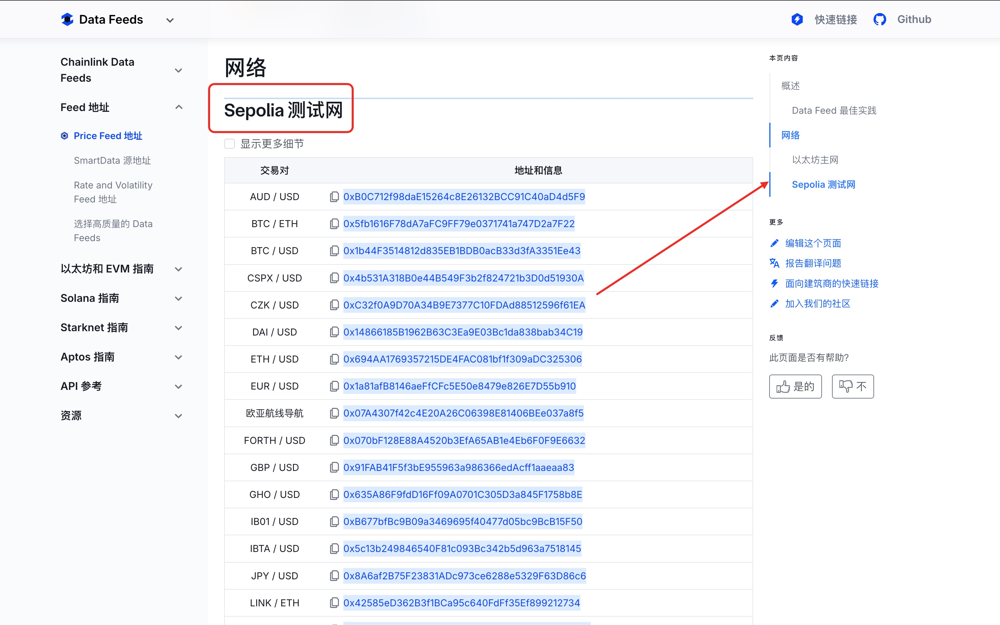

# 预言机集成

## 1. 预言机基础概念与分类
### 1.1 预言机的作用
- 桥接链上链下数据
- 解决智能合约外部数据依赖问题

### 1.2 预言机类型
- 软件预言机（API数据源）
- 硬件预言机（IoT设备）
- 共识预言机（多节点验证）

## 2. Chainlink预言机架构解析
### 2.1 核心组件
- Chainlink节点网络
- 数据源适配器（External Adapters）
- 链上合约（AggregatorProxy）

### 2.2 工作流程
1. 用户合约发出数据请求
2. Chainlink节点监听事件
3. 节点获取外部数据并签名
4. 聚合合约验证响应

## 3. 价格订阅合约实现
```solidity
// SPDX-License-Identifier: MIT
pragma solidity ^0.8.7;

import "@chainlink/contracts/src/v0.8/interfaces/AggregatorV3Interface.sol";

contract PriceConsumer {
    AggregatorV3Interface internal priceFeed;
    event PriceUpdated(int256 price);

    constructor(address _aggregator) {
        priceFeed = AggregatorV3Interface(_aggregator);
    }

    function getLatestPrice() public returns (int256) {
        (
            uint80 roundID,
            int256 price,
            uint startedAt,
            uint timeStamp,
            uint80 answeredInRound
        ) = priceFeed.latestRoundData();
        emit PriceUpdated(price);
        return price;
    }
}
```

## 4. 测试网环境配置
### 4.1 Chainlink测试网配置
1. 获取测试网LINK代币
2. 设置Sepolia测试网RPC URL [官方文档](https://docs.chain.link/data-feeds/price-feeds/addresses?network=ethereum&page=1)
3. 部署PriceFeed合约地址查询：
   - ETH/USD: 0x694AA1769357215DE4FAC081bf1f309aDC325306



## 5. 实践练习
1. 部署PriceConsumer合约到Sepolia测试网
2. 通过Chainlink预言机获取实时ETH价格
3. 实现价格阈值触发功能

## 6. 常见问题排查
- 检查LINK代币余额
- 确认Aggregator地址有效性
- 验证网络RPC连接状态