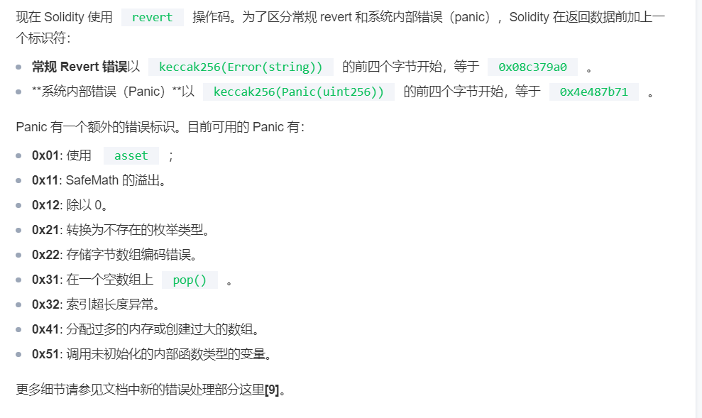
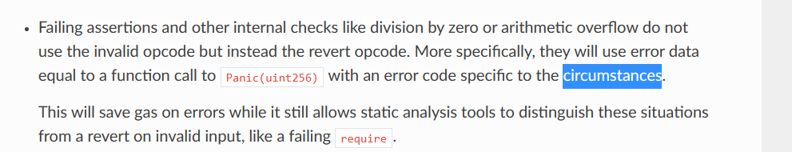

#  solidity智能合约开发

## 第一章 入门

### 必用资料

Solidity: [https://docs.soliditylang.org/en/v0.8.17](https://docs.soliditylang.org/en/v0.8.17/)[/](https://docs.soliditylang.org/en/v0.8.17/)

Remix Online：[https](https://remix.ethereum.org/)[://remix.ethereum.org](https://remix.ethereum.org/)[/](https://remix.ethereum.org/)

Remix Desktop：[https](https://github.com/ethereum/remix-desktop/releases)[://github.com/ethereum/remix-desktop/](https://github.com/ethereum/remix-desktop/releases)[releases](https://github.com/ethereum/remix-desktop/releases)

Remix Doc: [https://remix-ide.readthedocs.io/en/latest](https://remix-ide.readthedocs.io/en/latest/)[/](https://remix-ide.readthedocs.io/en/latest/)

课程·github： [https://github.com/baiyuqi/course-solidity.](https://github.com/baiyuqi/course-solidity.git)[git](https://github.com/baiyuqi/course-solidity.git)

### 智能合约根本性质

1. 智能合约在在本质上是一个合约，合同，或者叫契约。
2. 与传统应用系统的业务逻辑比较，合约所涉及的是跨组织的信任关系，开发不是通常的编码，升级，下线，而是：定约；修约；废约
3. 其他性质， 例如不可变性（immutable）是由这个根本性质决定的，例如开源。契约不能随意改变，契约也不可能保密
4. defi用以说明商业契约，dao用以说明更复杂的公共事务中的民主投票、代议制等“社会契约”


### 合约运行原理

1. 节点的一侧是交易，transaction，另一侧是EVM
2. block是顺序生成(广播，共识，确认)，transaction也是顺序生成：合约的执行是顺序的，没有“并发访问”
3. transaction被确认之后，触发EVM的执行(flashloan)


交易(transaction)的结构:

- from address

- to address：对合约调用型，to是合约地址

- value:  以太币数量

- calldata：函数调用信息


transaction处理逻辑

​	智能合约的执行是由transaction触发的-其实它就是在执行trabsaction，这个事实是深入理解智能合约语言中的看起来较为困难的知识的关键，你永远不应该忘记在纷繁语法背后的这个transaction的存在。上下文变量、calldata都与这个transaction有关。solidity是一个面向对象语言，但它在针尖上跳舞，它的背后是transaction和evm。

### solidity语言介绍

solidity文档： https://docs.soliditylang.org/en/v0.8.17/

1. 强类型，面向对象，多重继承
2. 参照c++
3. 编译器与IDE：solc remix

### 示例代码

```javascript
contract NumberStorage{
   uint public x;

   function setX(uint px) public /*默认是写操作*/ {
	x = px;
   } 
   function getX() public view returns(uint){
	return x;
   }
   function add(uint a, uint b) private pure returns(uint){
     	return a + b;//数学计算，由输入决定，与状态无关
   }
}

```

示例代码的学习任务：

1. 源文件layout，包括license，版本
2. contract的基本结构
3. 编译、部署、运行

对版本问题重点介绍：

1. solidity是新的语言，快速发展中，版本之间变化比较大
2. [semantic version](https://semver.org/)：major、minor、patch。patch level不包含breaking changes
3. **几个重要的变化：整型数运算中的溢出问题，函数默认可见性！**这些变化中，有些影响非常大，后续课程内容中会有所介绍。总体而言，开发者要非常注意这种变化！关于最新的major 0.8.x的变化参见：https://docs.soliditylang.org/en/v0.8.17/080-breaking-changes.html
4. remix中编译功能中选择版本

   

### 开发环境：编译器、框架与IDE

1. solc编译器：本地包：https://github.com/ethereum/solidity/releases ，还可以使用nodejs包 npm install  -g solc, 详情参见：https://docs.soliditylang.org/en/v0.8.17/installing-solidity.html#installing-solidity

2. remix：solidity语言的合约开发、测试、部署的IDE

3. truffle、hardhat: 有取代truffle趋势框架（合约打包，模拟器，测试框架。。。）vue，react

4. SDK：web3js、ethers.js：前后端可用，后端是nodejs， 前端通过工具转换成浏览器支持的的js。当然前端也可以直接静态引用相关js文件直接使用纯的js开发。js的历史漫长，情况复杂，是专业的前端领域问题，不作详细介绍

   **我们在课程中主要使用remix作为合约开发的IDE**

## 第二章 智能合约

1. 状态变量：数据: 成员

2. 函数：行为

3. 函数修饰器：AOP：访问控制：revert， require事件

4. event：日志: 是一种持久化-->transaction？

5. 构造函数：


### 状态变量

#### 	一般形式

​		类型 [可见性] 变量名

####  	可见性

- 三个subject：合约外部(其他合约，链下的钱包地址)，本合约，子合约

  public：完全可见：只读，不能写

  private：对本合约可见，其他不可见

  internal： 对继承子合约可见(java proteccted)

- 外部合约，外部账号   

- 变量默认是internal  


####  	 账号：account

  1.外部账号：钱包地址公私钥对中的私钥->非对称密码系统(RSA,Ecllipse Curve)->椭圆曲线的公钥（一种变形格式）->地址：address：20个字节160位的数据类型

  2.合约地址：20个字节160位的数据类型内部账号：合约账号


#### public : 

可见？可读，可写； **只读**

public只读--》自动生成同名函数

对于array， mapping形成某种面向元素的getter(index) getter(key)


### 合约函数

#### 一般形式：

function fname([参数])  [可见性][交易相关][..]  交易属性 returns(返回值){..} 

- 函数签名：fname([参数])
- 返回值：returns(返回值)
- 修饰：修饰部分内容丰富，重点讲[可见性][交易相关] 交易属性


#### 函数可见性

三个维度：合约外部，本合约，子合约

- public：完全可见
- private：对本合约可见，其他不可见
- internal： 对继承子合约可见(java proteccted)
- external：public （执行机制）   

默认是写public！这一点与其他语言完全不同!

#### 交易属性

(transactional) 默认是写操作：全网广播，共识确认。如果不是写操作，意味着区块链状态没有变化

view：合约状态读操作

pure：与合约状态无关的函数：为社么？纯函数：跟系统状态无关，只跟输入有关


写操作：重大：同步所有库 区块链 8000


#### 示例代码


```javascript
contract NumberStorage{
   uint public x;

   function setX(uint px) public /*默认是写操作*/ {
	x = px;
   } 
   function getX() public view returns(uint){
	return x;
   }
   function add(uint a, uint b) private pure returns(uint){
     	return a + b;//数学计算，由输入决定，与状态无关
   }
}
```

补充：函数交易属性中声明与实现不匹配问题，调用问题

## 第三章  数据类型

### 有关数据类型的全局性问题

在我们单独学习每种数据类型之前需要理解solidiy数据类型的几个基础问题，主要是这两个：

1. 值类型和引用类型
2. 任何类型的变量都没有“undefined”或null值，而是有一个特定于类型的默认值

#### 引用类型关于

数据类型最顶层的分类：值类型与引用类型，是所有现代高级语言的数据类型处理方法，这个方法在solidity中有一点额外的复杂性。首先，引用类型之“引用”的语义，在成员变量中是不存在的(在这里我们指成员变量自身，而不是它所指向或引用的数据块。一个storage location的局部变量可以指向成员变量所指的那个数据块)，或者说是完全失效的，不起作用的，因为成员变量在solidity中，技术上被处理成一些固定位置的storage槽，这一点是更本质的设计选择，关于数据类型的语义解释不可以与这个更高的设计选择相冲突，所以，引用在成员变量中就失去了语义。一个总是意指固定数据块的变量，能变的只能是它的值--这是一个极其重要的命题，大部分教程包括solidity官方文档都语焉不详，令人费解，引起极大的困惑。

​	正是由于这一点，在下面当我们谈及引用类型，引用，都指的是这个数据类型用来声明局部变量的时候。

​	我们从更具一般性的角度考察一下变量赋值问题。上述结论其实是在说，成员变量作为赋值操作中的赋值对象时，这种操作总是值拷贝，根源在于一种更高的、更本质的设计选择：成员变量应指向固定数据块。这是一种特殊的赋值操作的模式，其左侧是成员变量。那对于一般的赋值操作呢？那其实就是赋值操作的左侧不再是成员变量的情况，其实就是局部变量的情况(如果是函数参数，也跟局部变量没有区别)。这时我们就用到各种教科书都在谈论的规则：当右侧变量所指数据块的存储位置与左侧被赋值的局部变量相同，就会发生引用拷贝，否则就值拷贝。

​	总结一下：值拷贝或者引用拷贝，其实是对赋值操作如何解释的设计选择，这种选择不能与更本质、更内在的、更高的选择相冲突。比如成员变量，它固化、顽强地指向属于它自己的数据块，而不是像成员变量那样切换指向，所以当一个赋值操作对象是成员变量时，只能是对这个成员变量数据块的数据拷贝。而对于赋值对象是局部变量的情况，如果右侧是一个相同存储位置的变量（局部或成员），解释为引用拷贝不与其他更高设计选择冲突，但是如果右侧是一个不同location的变量，如果让左侧变量指向这个数据块，就意味着一个局部变量实际引用的数据块的位置跟它所声称的不一致--这完全违背了静态类型语言的编译时安全要求，而且这种编译时类型安全显然是更为根本的设计选择之一。

​	所以关于数据类型中的引用拷贝还是值拷贝这一纠结问题，我们用一句话来总结：

​	当这种赋值被解释为引用拷贝时如果不与其他优先级更高的设计选择相冲突，则这个赋值是引用拷贝，否则就是值拷贝。前面两个命题都是这一命题的推论。

​	做过这样的分析之后，在具体数据类型有关引用的讨论中，我们其实就不必关心成员变量的情况，因为这时没有引用的立足之地，只能是值拷贝。我们只需要考察局部变量下的情况。

​	calldata变量不会出现在赋值右侧，所以不去讨论它。

​	

#### 关于默认值与初始化

​	成员变量和memory 存储位置的局部变量都会进行默认值的初始化，不需要进行初始赋值，但是storage或者calldata的局部变量不行，必须是经过赋值才能参与逻辑或者作为返回值(早期版本不是这样)。默认值是什么，由具体数据类型自己管理。

​	有一个费解的问题。storage或者calldata的局部变量不经赋值不能被使用，但这是编译器的语法检查，而运行时并不存在一种null或者undefined这样的值来引发运行时异常。编译器可以保证运行时不会出现未经赋值的storage局部变量，也就不必问这时它的值是什么。但在早期版本，编译器不做这种检查，未经赋值的storage局部变量也确实有值：指向slot 0. 这是一个安全漏洞。

​	习惯于java或python等面向对象语言的朋友会比较困惑：java中引用类型的变量要进行某种赋值才能使用，而在solidity中，引用变量(指的是成员或者memory 局部)与值变量一样，自动分配数据块并完成默认值的初始化。

### 值类型(value type)

#### 整型数

1. int/uint， 以8位为步长递增
  

2. 对于整型数x，可以用type(x).min和type(x).max取这个类型的最大值或最小值

3. 以太坊虚拟机是256位的机器

4. 版本问题：低版本取模，高版本：异常；Safe'Math

     ```javascript
       uint8 x = 255；
       x++；//低版本x变为0，高版本越界异常 %256
       
       
       
     ```

5. uint是uint256的alias

用以下代码测试不同版本：

```
    function add(uint8 x, uint8 y)public pure returns(uint8 s){
       s = x + y;
    }
    function sub(uint8 x, uint8 y)public pure returns(uint8 s){
       s = x - y;
    }
    function mult(uint8 x, uint8 y)public pure returns(uint8 s){
       s = x * y;
    }
```


#### 定长字节数组

1. 从bytes1到bytes32
2. 通过下标访问元素

```javascript
bytes32 array;
byte b = array[1];

bytes data = new bytes(5);
```
3. 通过length读取长度


> 定长字节数组是值类型，这是比较特殊的。一般的定长数组是引用类型，其实一般数组都是引用类型，但“定长字节数组”却被安排成了值类型。实际上定长字节数组已经不应被当作数组来看待，而应被当作一个整体来看待，当作像(u)int8-256这样的基础类型来看
>
> 定长数组中的bytes1已经没有byte这个别名，这是常常被忽略的地方。byte并不是solidity关键字。

#### 地址类型

1. address：20个字节长度

2. 关于可支付：
   - address payable: 可支付，有成员函数transfer和send
   - address payable可转换为address，反之需要显式转换

3. address可转换为uint160和bytes20

4. 合约账号地址与外部账号地址 EOA External Owned Account

    

5. call，balance等，很大程度上address并不只是一个数据类型了

    

#### 合约类型

每个contract定义生成了一种独立数据类型。所谓合约类型并不是一个类型，每定义一个合约，就在定义一种类型。struct与此类似。

1. 合约可以隐式转换为它的父合约(多态)

2. 合约可以显式转换为地址类型address
           
  

	```
     MyContract c；//赋值
     address addr = address(c);
  ```


3.   合约不支持任何运算符

4. 从合约变量(实例)调用合约函数

5. 合约可用new操作符部署另一合约

#### 枚举类型

1. 枚举是用户创建自定义类型的一种方法(contract, struct, enum)
2. 可以与整型数显式转换(隐式不行)
3. 整形到枚举的转换会检查是否越界
4. 枚举最少一个成员，最多256成员(uint8)，默认值第一个成员
5. 从0开始的无符号整型数(与c相同)

### 引用类型

#### 映射(mapping)

1. 声明形式：mapping(type=>valuetype)
2. keytype可以是任何基本类型，包括bytes和string， 不包括用户自定义的复杂类型--合约，枚举，结构，映射。
3. valuetype可以是包括mapping在内的任何类型
4. 可以作为状态变量、storage型局部变量、库函数的参数；不能作为共有函数的参数和返回值
5. public的mapping会自动生成getter；嵌套的mapping生成的mapper会有多个参数
6. mapping无法遍历 storage layout

#### 数组

成员变量中的动态数组和memory中的动态数组在编译器看来是一个类型：可以进行赋值操作；但是两者支持的操作集合却又不同--从这点来看应该视作不同类型。这是solidity语言对观念一致性的破坏。如果选择不去纠结也并非不可理解。solidity中我们要接受storage造成的特有问题。

storage

1. 中的数组可以在声明时指定长度，也可以动态调整大小（对storage layout的影响？）；数组类型为T，固定长度K的数组声明为T[K], 动态数组声明为T[]。
2. 数组可以是任何类型，包括结构和映射；对类型的限制是映射只能存储在storage中
3. push() pop() 函数只能操作storage类型的动态数组(其他非storage的或虽是storage但是静态定长的不行)。--需要仔细解释
4. public 的数组成员变量的getter参数是下标

内存memory

   不能是mapping

   都是定长的 new T[](size), 显然内存数组不能push(), pop().


下标超出数组长度的访问会抛出异常


```
contract Sample{
    string[] private arr;
    function arraySaple()public view{
        arr.push("hello");
        uint len = arr.length;
        tring value = arr[0];
    }
    
}

contract TX{
    function f(uint len)public pure{
        uint[]  memeory a = new uint[7];
        uint[]  memeory a = new uint[len];
        assert(a.length == 7);
        assert(b.length == len);
        a[6] = 7;
    }
}
```


#### 变长字节数组与字符串

1. 他们都是数组类型而不是值类型

2. string是utf-8字节数组，但不可以索引访问

3. solidity没有字符串操作函数，可使用第三方库

4. string可以转换bytes，转换时数据不会拷贝

   ```
   function string2bytes(string memory data)public pure returns(bytes memory){
       bytes memory rst = bytes(data);
       return rst;
   }
   ```

5. 根据应用场景，对于任意长度数据用bytes，任意长度字符串用string，而如果长度确定的数据，使用bytes1到bytes32--gas

```
As a rule of thumb, use `bytes` for arbitrary-length raw byte data and `string` for arbitrary-length string (UTF-8) data. If you can limit the length to a certain number of bytes, always use one of `bytes1` to `bytes32` because they are much cheaper. 
```

> *`关于string与bytes：bytes虽然被称之为字节数组，但它并不是元素为字节数据的变长数组，bytes和string各自是一种独立的数据类型，它们与数组区别很大。某种意义上它们是动态数组：其长度在运行时确定，而不是编译时，这一点跟内存中的动态数组一样；它们在声明为成员变量时，其行为与内存动态数组一样，也是一种运行时确定尺寸的动态，而不是元素增减；这一点跟成员中的动态数组不同。`*
>
> string可以强制转换为bytes在进行底层二进制操作，这使得string的new string(length)这种初始化方式变得有意义。
>
> string与bytes关系很密切，高度类似，但string是面向字符串表现的，而bytes是面向二进制的。
>
> 

#### 结构(struct)

结构如同contract和enum，用来自定义数据类型

状态变量、局部变量、参数与返回值均可用结构

结构可放在mapping'和数组中，结构的成员可以是mapping或数组

### 函数上下文变量初步

•外部账号调用函数时，函数的背后都对应着交易transaction，transaction又对应一个block


msg是transaction的一个拷贝

•msg.sender:address

•msg.data;

•msg.value:eth

### 存储位置

storage：数据库，文件

memory：内存：局部变量：值类型，引用类型

calldata：来自于上下文中msg.data 只读

### 综合练习

```javascript
pragma solidity 0.8.13;
//ERC20
//ICO
contract MyErc20Token{
    string public name  = "BYQ";
    string public symbol  = "$";
    uint public decimals  = 4;
    mapping(address=>uint) public balanceOf;

    constructor(uint _t){
        total = _t;
    } 
    function mint() public payable{
        retuire(current + msg.value < total, "");

        balanceOf[msg.sender] = balanceOf[msg.sender] + msg.value;
    } 


    event TransferEvent(uint oldv, uint newv);

    modifier nottoolarge(uint _x){
        require(_x < 10000, "too large!");
        if(_x >= 10000)
            revert("too large");
        _;//执行所修饰的函数体
    } 

    function transfer(address to, uint amount ) public nottoolarge(amount){
        address from = msg.sender;
        uint current = balanceOf[from];
        if(current <= amount)
            revert("not enough balance!");
        uint toc = balanceOf[to];
        
        current -= amount;
        toc += amount; 
        balanceOf[from] = current;
        balanceOf[to] = toc;
    }
}
```


场景：

1. 参与一个去中心化交易所，用我的资产交易另外一种资产
2. 交易所的资产交换逻辑也是合约实现，并且我完全了解交换逻辑，信任没有问题 0x uniswap
3. 我要事先授权给交易合约，让它在合适的时候，子东替我完成交易


## 第四章 web3js合约访问

### web3j的输入：abi

- application binary interface
- 只有函数签名信息，没有实现
- 做一个实验，将SimpleContract变为接口，看abi变化
- 示例: 


```javascript
// SPDX-License-Identifier: MIT
pragma solidity ^0.8.13;

contract SimpleContract {
    uint public x;
    function setX(uint _x) public {
        x = _x;
    }
}
```


```json
	"abi": [
			{
				"inputs": [
					{
						"internalType": "uint256",
						"name": "_x",
						"type": "uint256"
					}
				],
				"name": "setX",
				"outputs": [],
				"stateMutability": "nonpayable",
				"type": "function"
			},
			{
				"inputs": [],
				"name": "x",
				"outputs": [
					{
						"internalType": "uint256",
						"name": "",
						"type": "uint256"
					}
				],
				"stateMutability": "view",
				"type": "function"
			}
		]
```

### web3js使用方法

1. 导入web3js源文件
2. 调起登录metamask
3. 用abi生成contract对象
4. 调用合约：读操作call与写操作sendTransaction

## 第五章 函数调用方式

### 通过import函数定义定义

### 通过自定义接口调用

### 综合举例


## 第六章 函数运行中的上下文变量


-  一次外部账号对合约的调用，可能引发一系列合约之间的调用；所有这些调用，背后是一个block，一个transaction
-  直接被外部账号调用的那个函数，transaction和message是同一的
-  调用跨越合约时，产生新的message合约内部的调用，背后是一个message，message没有变化
-  合约内部调用，message没有变化
-  external 和this使得内部调用变成了合约间调用
-  transaction，internal transaction


## 第七章 函数动态调用-call

### call

1. <adress>.call(bytes calldata) 
2. call是address的方法
3. call返回值(bool success , bytes data)

（require， revert）触发异常时，call的返回值返回false，忽视返回值success，会造成严重问题

### 关于calldata

调用：address.call(bytes calldata): 调用的函数 + 参数

1. call的参数是calldata

2. calldata的前四个字节是selector，剩下的的是参数编码--理解

   ```
   bytes4 selector = bytes4(keccak256(<sig>));//--了解 keccak256：哈希sha3->256
   <sig>：signature "fname(参数类型)"
   keccak256: sha256哈希运算-》256位的二进制数据
   取前四个字节
   
   
   ```

   

3. 代码中获得calldata

   ```
   bytes cdata= abi.encodeWithSignature(sig， ps)；//--会用；encodeWithSignature:是abi函数：库函数
   ```

   

### 示例代码

静态示例：

```
contract Callee{
 uint x;
 function setX(uint px) public {
	x = px;
  } 
}

import “callee.sol”;//依赖源码
contract Caller{
    Callee callee;

    function SetCaleeX(){
         callee.setX(12);//编译时检查
    }
}

```

动态示例：

```
contract Callee{
    uint x;
    function setX(uint px， uint y) public returns（string memory）{
	x = px;
    } 
}

//“callee.sol”;1.不必依赖被调用合约源码
contract Caller{
// Callee callee; 
    address callee;
    function SetCaleeX(){
	bytes memory calldata = abi.encodeWithSignature(“setY(uint)”， 12，13);
   
    (bool suc, _) = callee.call(calldata);

	if(!suc)//2. 不要忘记检查函数调用是否成功！
		revert(“erro!”)
    }
}

```

### fallback函数

1. 特殊函数，“备胎”函数
2. 动态调用call绕过类型检查，或者自己定义一个接口函数，但是这个函数并不存在，fallback才有机会起作用
3.  proxy模式中有重要应用：delegatecall：支持合约升级
4. 转账功能中有重要作用

### 其他

1. delegatecall
2. staticcall
3. callcode

## 第八章 gas与转账

### 老的转账机制

- address.send
- address.transfer
- receive

把问题搞复杂，不主张用，也不再讲，不作为本课内容

### 为什么要有gas：油：指令算出来的 油费 gasPrice

- 经济学设计： 成本
- 成为矿工收入

### 合约可以有钱

- 合约可以有钱！
- 合约与其他合约或者EOA之间可以转账
- multisig钱包

以太币单位


### gas和gas price

https://github.com/wolflo/evm-opcodes/blob/main/gas.md

- 实际的gas是完全由执行逻辑决定的，一个固定的逻辑的合约函数执行，gas没有变化，有变化的是gas的价格，是由transaction来设定交

  

- 交易发起者设定最多消耗多少：gaslimit；剩下没用完的gas会“退款”， 交易失败时，已经用了的gas不退

- 合约之间函数调用可以设置gaslimit：调用者来控制gas消耗

### 转账与函数调用

- 没有单独的转账逻辑，转账是与函数调用一起发生的。
- 转账就是函数调用调用时加上调用选项{gas:<gas>, value:<value>}    ccontracta.foo{option}();
- 被调用者加上payable修饰符

### 另一个视角


- 上图是我们之前学过的函数调用的正常执行逻辑
- 在上述逻辑的理解之上，转账逻辑是：如果value为空，上述逻辑正常执行；如果value不为空，则要看解析出来的   目标函数是否是payable

### 几点说明

- 通过静态函数调用转账fname{gas:<gas>, value:<value>}()，被调用的普
- 通函数用payable修饰，接收转账通过动态函数调用aadress.call{gas:<gas>, value:<value>}(calldata)转账，被调用函数payble修饰如果调用没带钱，被调用者不必payable；
- 如果带钱了，但是被调用者没有payable，就会失败
- 函数调用都可以附带做转账操作


### 示例代码

```javascript
// SPDX-License-Identifier: MIT
pragma solidity ^0.8.13;

contract ReceiveEther {
    uint public x;
    /*
    Which function is called, fallback() or receive()?

           send Ether(函数调用)
               |
         msg.data is empty?
              / \
           no   yes
            /     \
fname() exists?  fallback()
         /   \
        yes   no
        /      \
    fname()   fallback()
    */

  
    event Fallback(bytes cdata, uint value, uint gas);
    event Foo(bytes cdata, uint value, uint gas);
   
    // Fallback function is called when msg.data is not empty
    fallback() external  {
        emit Fallback(msg.data, 0, gasleft());
    }

    function getBalance() public view returns (uint) {
        return address(this).balance;
    }
    function foo() public payable {
        emit Foo(msg.data, msg.value, gasleft());
    }

}

contract SendEther {


    function sendViaCall(address payable _to) public payable {

        (bool sent, ) = _to.call{value: msg.value}("");
        require(sent, "Failed to send Ether");
    }
    function sendViaFoo(address payable _to) public payable {

        ReceiveEther re = ReceiveEther(_to);
        re.foo{gas:2300, value: msg.value}();
        //msg.value是sendViaFoo的调用者发送给SendEther
      
    }
}

```

## 第九章 练习与补充

Myerc20 token中补充一种链上募资逻辑：

```
/**
 *Submitted for verification at Etherscan.io on 2021-07-26
*/
//0xd9145CCE52D386f254917e481eB44e9943F39138
//0xd9145CCE52D386f254917e481eB44e9943F39138
// SPDX-License-Identifier: NONE
//0xD06dd5C9508Ecf179e4A70341edf924C5427d2d5
pragma solidity 0.8.13;
//ERC20
//ICO
contract MyErc20Token{
    string public name  = "BYQ";
    string public symbol  = "$";
    uint public decimals  = 4;
    address public owner;
    mapping(address=>uint) public balanceOf;
 
    constructor(){
       owner = msg.sender;
    } 
    function mint()external payable {
        balanceOf[msg.sender] += msg.value; 
    }


    event TransferEvent(uint oldv, uint newv);

    modifier isOwner(){
        require(msg.sender == owner, "not owner!");
        
        _;//执行所修饰的函数体
    } 

    function transfer(address to, uint amount ) public {
        address from = msg.sender;
        uint current = balanceOf[from];
        if(current <= amount)
            revert("not enough balance!");
        uint toc = balanceOf[to];
        
        current -= amount;
        toc += amount; 
        balanceOf[from] = current;
        balanceOf[to] = toc;


    }
    function withdraw()external isOwner(){
        (bool suc, bytes memory data) = owner.call{value: address(this).balance}("");
        require(suc, "failed !");
    }
   
}
```


## 第十章 delegatecall

本节学习内容：

1.delegateCall--语法调用方式

2.storage layout--存储布局--state variable在存储空间中是如何分布，构造


### delegatecall

wyvern compound

- address.delegatecall(bytes calldata)

- delegatecall是将另一个合约的一个函数take over拿来当作自己合约内部函数来用;

- 从函数执行上下文来看，形式上跨合约，实质上没有跨合约，拷贝了message，sender、value不变，但data和gaslimit可以变化

- 函数按照内存布局访问变量，delegatecall的调用者和被调用者合约应该具有兼容的storage（一模一样？） layout

  *思考题：delegatecall会有调用选项{gas：，value：}吗？*

  *注意：msg.gas被gasleft()取代*

  代码调试观察内部调用和delegatecall中msg.data的变化不同


### 示例

```javascript
// SPDX-License-Identifier: MIT
pragma solidity ^0.8.13;

// NOTE: Deploy this contract first
contract B {
    // NOTE: storage layout must be the same as contract A
    uint public num;
    address public sender;
    uint public value;
    bytes public cdata; 

    function setVars(uint _num) public payable {
        num = _num;
        sender = msg.sender;
        value = msg.value;
        cdata = msg.data;
    }
}

contract A {
    uint public num;
    address public sender;
    uint public value;
   bytes public cdata; 

    function setVars(address _contract, uint _num) public payable {
        // A's storage is set, B is not modified.
        (bool success, bytes memory data) = _contract.delegatecall(
            abi.encodeWithSignature("setVars(uint256)", _num)
        );
    }

    function setNum(uint _num) public payable {

        num = _num;
        cdata = msg.data;
        sender = msg.sender;
        value = msg.value;

    }
    function setNumIndirect(uint _num) public  {
        setNum(_num);
    }
    function setNumIndirectByCall(uint _num) public  {
        address(this).call(abi.encodeWithSignature("setNum(uint256)", _num));
    }
}


```


### 存储布局

成员变量或者状态变量在合约的存储空间中的分布

#### 值变量存储布局

1. The first item in a storage slot is stored lower-order aligned.  slot-存储曹：256位存储单元

2. Value types use only as many bytes as are necessary to store them.

3. If a value type does not fit the remaining part of a storage slot, it is stored in the next storage slot.  另外起一个slot：byte24->1   byte16->2

4. Structs and array data always start a new slot and their items are packed tightly according to these rules.

5. Items following struct or array data always start a new storage slotstruct

   结构和定长数组：自己另起slot，他的后继也是另起

#### Mappings and Dynamic Arrays 动态类型存储布局

不定长数组：在公共存储布局中，只占一个slot，存数组长度

uint s1;

mapping:  m:  256 p= 1

uint s2

```
index = keccak256(p)；//p：插槽下标； 256位
```

mapping：keccak256(h(k) . p)在公共存储布局中，只占一个slot，什么也不存

```
value-index = keccak256(keccak256(k), p);//   p：插槽下标；k：键
value-index = f(k, p);
1. 得到的不是mapping整体存储位置，而是某个键所对应的存储位置
2.value-index = f(k, p);
```

## 第十一章 函数调用机制的贯通与综合


1. 结合合约调用上下文概念图综合回顾EOA调用、合约间调用、合约内部调用、delegatecall调用的msg变化
2. 技术上可行，应用上没有意义的调用：call、delegatecall调用合约内部函数、调用view和pure函数
3. 注意各种调用的{gas:, vaue:}，理解为什么

代码实验以上各种场景中msg变化

### EOA:

```
// SPDX-License-Identifier: MIT
pragma solidity ^0.8.13;

// NOTE: Deploy this contract first
contract B {
    // NOTE: storage layout must be the same as contract A
    uint public num;
    address public sender;
    uint public value;
    bytes public cdata; 

    function setVars(uint _num) public payable {
        num = _num;
        sender = msg.sender;
        value = msg.value;
        cdata = msg.data;
    }

}
```

### 内部调用

```
// SPDX-License-Identifier: MIT
pragma solidity ^0.8.13;

// NOTE: Deploy this contract first
contract B {
    // NOTE: storage layout must be the same as contract A
    uint public num;
    address public sender;
    uint public value;
    bytes public cdata; 

    function setVars(uint _num) public payable {
        num = _num;
        sender = msg.sender;
        value = msg.value;
        cdata = msg.data;
    }
    function setVarsIndirect(uint _num) public payable {
        setVars(_num);
    }
}
```

### 合约之间

```
// SPDX-License-Identifier: MIT
pragma solidity ^0.8.13;

// NOTE: Deploy this contract first
contract B {
    // NOTE: storage layout must be the same as contract A
    uint public num;
    address public sender;
    uint public value;
    bytes public cdata; 

    function setVars(uint _num) public payable {
        num = _num;
        sender = msg.sender;
        value = msg.value;
        cdata = msg.data;
    }

}

contract A {

    function setVarsB(address _contract, uint _num) public payable {
        B b = B(_contract);
        b.setVars(_num);
    }
    function setVarsBByCall(address _contract, uint _num) public payable {
        // A's storage is set, B is not modified.
        (bool success, bytes memory data) = _contract.call(
            abi.encodeWithSignature("setVars(uint256)", _num)
        );
    }
}


```

### view 或pure函数以交易方式调用

没有意义，但可以这么做

```
// SPDX-License-Identifier: MIT
pragma solidity ^0.8.13;

// NOTE: Deploy this contract first
contract B {

    function testPure() public pure returns(bytes memory) {
        return msg.data;
    }
}
```

### 内部函数调用时，使用call来调

会导致一种合约间调用方式：新生成msg（当内部用this调用external函数就是这种情况）


```
// SPDX-License-Identifier: MIT
pragma solidity ^0.8.13;

// NOTE: Deploy this contract first
contract B {
    // NOTE: storage layout must be the same as contract A
    uint public num;
    address public sender;
    uint public value;
    bytes public cdata; 

    function setVars(uint _num) public payable {
        num = _num;
        sender = msg.sender;
        value = msg.value;
        cdata = msg.data;
    }
    function setVarsIndirectByCall(uint _num) public  {
       address(this).call(abi.encodeWithSignature("setVars(uint256)", _num));
    }
}
```

```
// SPDX-License-Identifier: MIT
pragma solidity ^0.8.13;

// NOTE: Deploy this contract first
contract B {
    // NOTE: storage layout must be the same as contract A
    uint public num;
    address public sender;
    uint public value;
    bytes public cdata; 

    function setVars(uint _num) external payable {
        num = _num;
        sender = msg.sender;
        value = msg.value;
        cdata = msg.data;
    }
    function setVarsIndirectByExternal(uint _num) public  {
       this.setVars(_num);
    }
}
```

### 内部函数调用使用delegatecall

没有意义，但可以这么做

```
// SPDX-License-Identifier: MIT
pragma solidity ^0.8.13;

// NOTE: Deploy this contract first
contract B {
    // NOTE: storage layout must be the same as contract A
    uint public num;
    address public sender;
    uint public value;
    bytes public cdata; 

    function setVars(uint _num) public payable {
        num = _num;
        sender = msg.sender;
        value = msg.value;
        cdata = msg.data;
    }
    function setVarsIndirectByCall(uint _num) public  {
       address(this).delegatecall(abi.encodeWithSignature("setVars(uint256)", _num));
    }
}
```

### 定义接口访问合约，接口中的函数在合约中并不存在：

```
// SPDX-License-Identifier: MIT
pragma solidity ^0.8.13;
interface Client{
    function setX() external;
}
// NOTE: Deploy this contract first
contract B {
    address public sender;
    uint public value;
    bytes public cdata; 
    fallback()external payable{
        sender = msg.sender;
        value = msg.value;
        cdata = msg.data;
    }
}
```

delegatecall中，被调用者又通过call调用了自己的函数？

```
// SPDX-License-Identifier: MIT
pragma solidity ^0.8.13;

// NOTE: Deploy this contract first
contract B {
    // NOTE: storage layout must be the same as contract A
    uint public num;
    address public sender;
    uint public value;
    bytes public cdata; 

    function setVars(uint _num) public payable {
        num = _num;
        sender = msg.sender;
        value = msg.value;
        cdata = msg.data;
    }
 function setVarsByCall(uint _num) public payable {
       (bool suc, bytes memory data)  = address(this).call(abi.encodeWithSignature("setVars(uint256)", _num));
       if(!suc)
       {
           revert("B call setVars of B fail");
       }
    }

}

contract A {

    uint public num;
    address public sender;
    uint public value;
    bytes public cdata; 
    function setVarsAByDelegateCall(address _contract, uint _num) public payable {
        // A's storage is set, B is not modified.
        (bool success, bytes memory data) = _contract.delegatecall(
            abi.encodeWithSignature("setVarsByCall(uint256)", _num)
        );
         if(!success)
       {
           revert("A call setVarsByCall of B fail");
       }
    }
}
```


结果是：交易执行失败。被delegatecall调用的代码中不能再有call？

反复修改call和delegatecall的链，结论是：

1. delegatecall调用另一合约，这个合约不能嵌入调用自己的call，也不能嵌入调用自己的delegatecall，也不能通过this调用(相当于用call)，功能设计上也没有这样的必要场景，solidity禁止这样做是合理的。这一点要非常关注！

2. delegatecall中，合约之间的delegatecall，call都没有问题。当delegatecall中出现合约之间的call时，delegate语义被切断，被call的合约执行call语义，不受之前的delegatecall影响 

3. 一个合约只有被非delegatecall调用，才会成为上下文主体，否则它“从属于”那个通过delegatecall调用它的合约

   

    


```
// SPDX-License-Identifier: MIT
pragma solidity ^0.8.13;

// NOTE: Deploy this contract first
contract C {
    // NOTE: storage layout must be the same as contract A
    uint public num;
    address public sender;
    uint public value;
    bytes public cdata; 

    function setVars(uint _num) public payable {
        num = _num;
        sender = msg.sender;
        value = msg.value;
        cdata = msg.data;
    }


}
contract B {
    // NOTE: storage layout must be the same as contract A
    uint public num;
    address public sender;
    uint public value;
    bytes public cdata; 


 function setVarsByCall(address c, uint _num) public payable {
             num = _num;
        sender = msg.sender;
        value = msg.value;
        cdata = msg.data;
       (bool suc, bytes memory data)  = c.call(abi.encodeWithSignature("setVars(uint256)", _num));
       if(!suc)
       {
           revert("B call setVars of B fail");
       }
    }

}

contract A {

    uint public num;
    address public sender;
    uint public value;
    bytes public cdata; 
    function setVarsAByDelegateCall(address b, address c, uint _num) public payable {
        // A's storage is set, B is not modified.
        (bool success, bytes memory data) = b.delegatecall(
            abi.encodeWithSignature("setVarsByCall(address,uint256)", c, _num)
        );
         if(!success)
       {
           revert("A call setVarsByCall of B fail");
       }
    }
}
```

### 设计原则：

1. 合约内部函数之间的调用，应避免产生新的上下文；
2. 如果external关键字修饰的函数需要被内部调用，应将其变为public，避免使用this关键字来调用。

### 存储位置

1. array（string）， struct,  mapping，其中mapping只能是storage的

2. 相同存储位置的变量赋值没有拷贝，只是引用；不同存储位置的变量赋值意味着拷贝

3. calldata是immutable的

4. 注意参数声明中的calldata与memory，storage的用法：重点讲一下

    

   ```
   // SPDX-License-Identifier: MIT
   pragma solidity ^0.8.13;
   
   contract DataLocations {
       uint[] public arr;
       mapping(uint => address) map;
       struct MyStruct {
           uint foo;
       }
       mapping(uint => MyStruct) myStructs;
   
       function f() public {
           // call _f with state variables
           _f(arr, map, myStructs[1]);
   
           // get a struct from a mapping
           MyStruct storage myStruct = myStructs[1];
           // create a struct in memory
           MyStruct memory myMemStruct = MyStruct(0);
       }
   
       function _f(
           uint[] storage _arr,
           mapping(uint => address) storage _map,
           MyStruct storage _myStruct
       ) internal {
           // do something with storage variables
       }
   
       // You can return memory variables
       function g(uint[] memory _arr) public returns (uint[] memory) {
           // do something with memory array
       }
   
       function h(uint[] calldata _arr) external {
           // do something with calldata array
       }
   }
   
   ```

   

## 第十二章 代理模式与合约升级

### 升级问题

- 合约要稳定，技术上区块链的immutability不可变性，但是由于商业或法律的原因，合约可能修订，由于漏洞，被攻击时需要紧急处理，这是升级的必要性。治理：governance。
- 由于合约技术上的不可变性，升级需要特殊技术与模式支持
- 升级应不伤害去中心化与民主(观念冲突)：


### 代理模式

- proxy和implementation内存布局兼容
- proxy有成员变量指向implementation，并且有函数可以切换implementation
- proxy实现fallback函数，不实现功能函数，fallback调用implementation.call并传递msg.data
- implementation实现功能函数并被proxy转发的calldata解析调用
- proxy的调用者用自己定义的功能接口调用proxy


```javascript

// SPDX-License-Identifier: MIT
pragma solidity ^0.8.13;
interface ProxyInterface {
    function inc() external;
}
contract Proxy {
    address public implementation;
    uint public x;
    function setImplementation(address _imp) external {
        implementation = _imp;
    }

    function _delegate(address _imp) internal virtual {
        (bool suc, bytes memory data) = _imp.delegatecall(msg.data);
        if(!suc)
            revert("failed!");
    }

    fallback() external payable {
        _delegate(implementation);
    }
}

contract V1 {
    address public implementation;
    uint public x;

    function inc() external {
        x += 1;
    }
}

contract V2 {
    address public implementation;
    uint public x;

    function inc() external {
        x += 1;
    }

    function dec() external {
        x -= 1;
    }
}
```

### 实验：把proxy的x去掉


### proxy-pattern的几个技术技巧

openzepellin: framework：升级模式


#### public view的返回值：用汇编

```
function _delegate(address _imp) internal virtual {
        assembly {
            // calldatacopy(t, f, s)
            // copy s bytes from calldata at position f to mem at position t
            calldatacopy(0, 0, calldatasize())

            // delegatecall(g, a, in, insize, out, outsize)
            // - call contract at address a
            // - with input mem[in…(in+insize))
            // - providing g gas
            // - and output area mem[out…(out+outsize))
            // - returning 0 on error and 1 on success
            let result := delegatecall(gas(), _imp, 0, calldatasize(), 0, 0)

            // returndatacopy(t, f, s)
            // copy s bytes from returndata at position f to mem at position t
            returndatacopy(0, 0, returndatasize())

            switch result
            case 0 {
                // revert(p, s)
                // end execution, revert state changes, return data mem[p…(p+s))
                revert(0, returndatasize())
            }
            default {
                // return(p, s)
                // end execution, return data mem[p…(p+s))
                return(0, returndatasize())
            }
        }
    }


    fallback() external payable {
        _delegate(implementation());
    }
}
```

#### unstructured storage：非结构化存储

思想：proxy低位存储中留下一张白纸，由implementation操作的“业务数据”一律不作定义，留给implementation管理，读和写都由implementation来进行；proxy自己需要的控制性变量通过指定存储槽避开低位存储槽

proxy中需要自己操作的变量(与V1、V2无关的变量)：用sload和sstore

storageload(uint index)

storagestore(uint index, bytes32 data)

```

    bytes32 private constant implementationPosition = keccak256("org.zeppelinos.proxy.implementation"); 
    function upgradeTo(address newImplementation)public {   
        address currentImplementation = implementation();   
        setImplementation(newImplementation); 
    } 
    function implementation() public view returns(address impl) {   
        bytes32 position = implementationPosition;   
        assembly {
            impl := sload(position)
        } 
    } 
    function setImplementation(address newImplementation) internal {   
        bytes32 position = implementationPosition;   
        assembly {
            sstore(position, newImplementation)
        } 
    } 
```


```
  // SPDX-License-Identifier: MIT
pragma solidity ^0.8.13;
interface ProxyInterface {
    function inc() external;
    function x() external view returns(uint);
}
contract Proxy {

    bytes32 private constant implementationPosition = keccak256("org.zeppelinos.proxy.implementation"); 
    function upgradeTo(address newImplementation)public {   
        address currentImplementation = implementation();   
        setImplementation(newImplementation); 
    } 
    function implementation() public view returns(address impl) {   
        bytes32 position = implementationPosition;   
        assembly {
            impl := sload(position)
        } 
    } 
    function setImplementation(address newImplementation) internal {   
        bytes32 position = implementationPosition;   
        assembly {
            sstore(position, newImplementation)
        } 
    } 


    function _delegate(address _imp) internal virtual {
        assembly {
            // calldatacopy(t, f, s)
            // copy s bytes from calldata at position f to mem at position t
            calldatacopy(0, 0, calldatasize())

            // delegatecall(g, a, in, insize, out, outsize)
            // - call contract at address a
            // - with input mem[in…(in+insize))
            // - providing g gas
            // - and output area mem[out…(out+outsize))
            // - returning 0 on error and 1 on success
            let result := delegatecall(gas(), _imp, 0, calldatasize(), 0, 0)

            // returndatacopy(t, f, s)
            // copy s bytes from returndata at position f to mem at position t
            returndatacopy(0, 0, returndatasize())

            switch result
            case 0 {
                // revert(p, s)
                // end execution, revert state changes, return data mem[p…(p+s))
                revert(0, returndatasize())
            }
            default {
                // return(p, s)
                // end execution, return data mem[p…(p+s))
                return(0, returndatasize())
            }
        }
    }


    fallback() external payable {
        _delegate(implementation());
    }
}

contract V1 {
    uint public x;

    function inc() external {
        x += 1;
    }
}

contract V2 {

    uint public x;

    function inc() external {
        x += 1;
    }

    function dec() external {
        x -= 1;
    }
}
 
```


## 第十三章 库library

代码复用：一个合约

### 一般性约束

- 不能有成员变量
- 不能有ether，函数不能payable
- 不能继承
- 不能selfdestruct
- 关于modifier：外部合约不能用

```
pragma solidity ^0.5.0;
library libraryName {
    // struct, enum or constant variable declaration
    //嵌入逻辑
    // function definition with body
    function f(){
        
    }
    
}
```

### 用法

#### import

```
import LibraryName from “./library-file.sol”;
```

```
pragma solidity >0.5.0;
library Library1 {
 // Code from library 1
}
library Library2 {
 // Code from library 2
}
library Library3 {
 // Code fom library 3
}
```

```
pragma solidity ^0.5.0;
// We choose to use only Library 1 and 3 here, and exclude Library 2
import {Library1, Library3} from "./library-file.sol";
contract MyContract {
    
    // Your contract code here
}
```

#### using关键字

> 语法糖

```
using LibraryName for Type
```

```

```


### 例子

```
// SPDX-License-Identifier: MIT
pragma solidity ^0.8.13;

library SafeMath {
    function add(uint x, uint y) internal pure returns (uint) {
        uint z = x + y;
        require(z >= x, "uint overflow");

        return z;
    }
}

library Math {
    function sqrt(uint y) internal pure returns (uint z) {
        if (y > 3) {
            z = y;
            uint x = y / 2 + 1;
            while (x < z) {
                z = x;
                x = (y / x + x) / 2;
            }
        } else if (y != 0) {
            z = 1;
        }
        // else z = 0 (default value)
    }
}

contract TestSafeMath {
   // using SafeMath for uint;
    using Math for uint;
    uint public MAX_UINT = 2**256 - 1;

    function testAdd(uint x, uint y) public pure returns (uint) {
        return SafeMath.add(x, y);
    }

    function testSquareRoot(uint x) public pure returns (uint) {
        return x.sqrt();
    }
}

// Array function to delete element at index and re-organize the array
// so that their are no gaps between the elements.
library Array {
    function remove(uint[] storage arr, uint index) public {
        // Move the last element into the place to delete
        require(arr.length > 0, "Can't remove from empty array");
        arr[index] = arr[arr.length - 1];
        arr.pop();
    }
}

contract TestArray {
   // using Array for uint[];

    uint[] public arr;

    function testArrayRemove() public {
        for (uint i = 0; i < 3; i++) {
            arr.push(i);
        }

        Array.remove(arr, 1);

        assert(arr.length == 2);
        assert(arr[0] == 0);
        assert(arr[1] == 2);
    }
    function getLibArrayAddress() public view returns(address){
        return address(Array);
    }
        function getLibMathAddress() public view returns(address){
        return address(Math);
    }
}
```

### 机制与内幕

1. 库的internal是inline到调用者代码中了
2. 库的public方法是library单独部署为合约，然后用delegatecall调用。所以，如果library有public方法，则必然是要单独部署的（Linked Library）。如果全是internal方法，则可以不部署(Embedded Library)
3. 当library因为有public而单独部署时，与proxy pattern相比照，都是利用另一个合约承载逻辑，但方式不用，一个利用存储布局，一个直接传递storage引用，上下文变量都保持在调用者一边。（调用者以delegatecall调用，由于library没有成员，被调用者只操作传入的参数，因此delegatecall不是像proxy pattern中的那样通过兼容存储布局利用另一合约逻辑的作用，而是通过操作storage属性的参数利用另一合约的逻辑）。
4. library的public，external函数传入storage参数，从这一点来看，说它是普通合约并不准确。
5. 调用者对单独部署的library的引用是在编译时完成，不是运行时，无法实现动态升级(是要故意为升级制造困难吗？)
6. internal: 对调用者可见，并且内联编译；private：library内部用，对library使用者不可见(仅从可见性解释上，library类似超类)。public：对library使用者可见，但是合约要单独部署
7. 交易属性：解释为对storage类型参数的操作，而不是成员；或者解释为对调用者成员变量的操作；两者等价

### struct和mapping

> `与contract不同，storage能够出现在public、external函数的参数中`。原来contract的public和external函数不能出现storage型参数，而mapping只有storage型，所以mapping也不能出现在public、external函数的参数中`，library中则可以。public和external是动态连接后用delegatecall调用library合约，用delegatecall调用一个合约函数而传递storage参数，并非是一般语法规则，是特定于library

```

pragma solidity >=0.7.0 <0.9.0;

library TransferOperation {
   
    function transfer(
     	address from, 
        address to, 
        uint amount, 
        mapping (address => uint) storage balanceOf
    ) public {
        
        uint current = balanceOf[from];
        if(current <= amount)
            revert("not enough balance!");
        uint toc = balanceOf[to];
        
        current -= amount;
        toc += amount; 
        balanceOf[from] = current;
        balanceOf[to] = toc;

    }
}
```

struct：一般被操作的结构类型在库中定义

```
pragma solidity >=0.7.0 <0.9.0;

library LibraryShape {
 
    struct Reactangle{
        uint width;
        uint height;
    }
 
    function area(Reactangle storage s) public view returns(uint){
         return s.width * s.height;
 
     }
}
contract Draw{
    using LibraryShape for LibraryShape.Reactangle;
    LibraryShape.Reactangle shape;
    function getArea()public view returns(uint){
        return shape.area();
    }
}
```


### 综合示例

注意几个细节：

1. 数据在数组中的存放从1开始 why?(每个未赋值的value的index都是0)
2. 数组数据不删除(不用pop)，而是标记deleted
3. mapping中的value删除时必须用delete(所有位变为0)


```javascript
/// @dev Models a uint -> uint mapping where it is possible to iterate over all keys.
pragma solidity ^0.8.13;
interface MyLib{
    function getX()external returns(uint);
}
library IterableMapping
{
  struct itmap
  {
    mapping(uint => IndexValue) data;
    KeyFlag[] keys;
    uint size;
  }
  struct IndexValue { uint keyIndex; uint value; }
  struct KeyFlag { uint key; bool deleted; }
  function getX()public returns(uint){
      return 12;
  }
  function insert(itmap storage self, uint key, uint value) public returns (bool replaced)
  {
    uint keyIndex = self.data[key].keyIndex;
    self.data[key].value = value;
    if (keyIndex > 0)
      return true;
    else
    {
        uint index = self.keys.length;
      self.keys.push(KeyFlag(key, false));

      self.data[key].keyIndex = index;
      self.keys[index].key = key;
      self.size++;
      return false;
    }
  }
  function remove(itmap storage self, uint key) internal returns (bool success)
  {
    uint keyIndex = self.data[key].keyIndex;
    if (keyIndex == 0)
      return false;
    delete self.data[key];
    self.keys[keyIndex - 1].deleted = true;
    self.size --;
    return true;
  }
  function contains(itmap storage self, uint key) internal view returns (bool)
  {
    return self.data[key].keyIndex > 0;
  }
  function iterate_start(itmap storage self) internal view returns (uint )
  {
      uint keyIndex = 0;
    while (keyIndex < self.keys.length && self.keys[keyIndex].deleted)
      keyIndex++;
    return keyIndex;
  }
  function iterate_valid(itmap storage self, uint keyIndex) internal view returns (bool)
  {
    return keyIndex < self.keys.length;
  }
  function iterate_next(itmap storage self, uint keyIndex) internal view returns (uint r_keyIndex)
  {
    keyIndex++;
    while (keyIndex < self.keys.length && self.keys[keyIndex].deleted)
      keyIndex++;
    return keyIndex;
  }
  function iterate_get(itmap storage self, uint keyIndex) internal view returns (uint key, uint value)
  {
    key = self.keys[keyIndex].key;
    value = self.data[key].value;
  }
}

// How to use it:
contract User
{
  // Just a struct holding our data.
  IterableMapping.itmap data;
  // Insert something
  function insert(uint k, uint v) public returns (uint size)
  {
    // Actually calls itmap_impl.insert, auto-supplying the first parameter for us.
    IterableMapping.insert(data, k, v);
    // We can still access members of the struct - but we should take care not to mess with them.
    return data.size;
  }
  // Computes the sum of all stored data.
  function sum() public view returns (uint s)
  {
    for (uint i = IterableMapping.iterate_start(data); IterableMapping.iterate_valid(data, i); i = IterableMapping.iterate_next(data, i))
    {
         (uint key, uint value) = IterableMapping.iterate_get(data, i);
        s += value;
    }
  }
  function getX(address lib) public {
      lib.call(abi.encodeWithSignature("getX()"));
  }
}
```


### 著名库

- [**Modular network**](https://github.com/modular-network/ethereum-libraries) **:** include several modular library utilities to use, such as [**ArrayUtils**](https://github.com/modular-network/ethereum-libraries/blob/master/ArrayUtilsLib/Array256Lib.sol)**,** [**BasicMath**](https://github.com/modular-network/ethereum-libraries/blob/master/BasicMathLib/BasicMathLib.sol)**,** [**CrowdSale**](https://github.com/modular-network/ethereum-libraries/blob/master/CrowdsaleLib/CrowdsaleLib.sol)**,** [**LinkedList**](https://github.com/modular-network/ethereum-libraries/blob/master/LinkedListLib/LinkedListLib.sol)**,** [**StringUtils**](https://github.com/modular-network/ethereum-libraries/blob/master/StringUtilsLib/StringUtilsLib.sol)**,** [**Token**](https://github.com/modular-network/ethereum-libraries/blob/master/TokenLib/TokenLib.sol)**,** [**Vesting**](https://github.com/modular-network/ethereum-libraries/blob/master/VestingLib/VestingLib.sol) and [**Wallet**](https://github.com/modular-network/ethereum-libraries/tree/master/WalletLib)
- **OpenZeppelin :** other libraries such as [**Roles**](https://github.com/OpenZeppelin/openzeppelin-solidity/blob/master/contracts/access/Roles.sol)**,** [**ECDSA**](https://github.com/OpenZeppelin/openzeppelin-solidity/blob/master/contracts/cryptography/ECDSA.sol)**,** [**MerkleProof**](https://github.com/OpenZeppelin/openzeppelin-solidity/blob/master/contracts/cryptography/MerkleProof.sol)**,** [**SafeERC20**](https://github.com/OpenZeppelin/openzeppelin-solidity/blob/master/contracts/token/ERC20/SafeERC20.sol)**,** [**ERC165Checker**](https://github.com/OpenZeppelin/openzeppelin-solidity/blob/master/contracts/introspection/ERC165Checker.sol)**,** [**Math**](https://github.com/OpenZeppelin/openzeppelin-solidity/blob/master/contracts/math/Math.sol)**,** [**SafeMath**](https://github.com/OpenZeppelin/openzeppelin-solidity/blob/master/contracts/math/SafeMath.sol) (to protect from overflow)**,** [**Address**](https://github.com/OpenZeppelin/openzeppelin-solidity/blob/master/contracts/utils/Address.sol)**,** [**Arrays**](https://github.com/OpenZeppelin/openzeppelin-solidity/blob/master/contracts/utils/Arrays.sol)**,**
- **Dapp-bin** by Ethereum : include interesting libraries like [**IterableMapping**](https://github.com/ethereum/dapp-bin/blob/master/library/iterable_mapping.sol)**,** [**DoublyLinkedList**](https://github.com/ethereum/dapp-bin/blob/master/library/linkedList.sol)**,** and another [**StringUtils**](https://github.com/ethereum/dapp-bin/blob/master/library/stringUtils.sol)


## 第十四章 继承

### 关于super函数调用：

1. 首先继承树线性化(c3 linearlization)
2. 查找线性结构中第一个匹配结果

```
// SPDX-License-Identifier: MIT
pragma solidity ^0.8.13;

/* Inheritance tree
   A
 /  \
B   C
 \ /
  D
*/

contract A {
    uint public x;
    // This is called an event. You can emit events from your function
    // and they are logged into the transaction log.
    // In our case, this will be useful for tracing function calls.
    event Log(string message);

    function foo() public virtual {
        emit Log("A.foo called");
    }

    function bar() public virtual {
        emit Log("A.bar called");
    }
}

contract B is A {
       uint private y;
    function foo() public virtual override {
        emit Log("B.foo called");
        A.foo();
    }

    function bar() public virtual override {
        emit Log("B.bar called");
        super.bar();
    }
}

contract C is A {
     uint private y;
    function foo() public virtual override {
        emit Log("C.foo called");
        A.foo();
    }

    function bar() public virtual override {
        emit Log("C.bar called");
        super.bar();
    }
}

contract D is B, C {
     uint public y;
    // Try:
    // - Call D.foo and check the transaction logs.
    //   Although D inherits A, B and C, it only called C and then A.
    // - Call D.bar and check the transaction logs
    //   D called C， and finally A.
    

    function foo() public override(B, C) {
        super.foo();
    }

    function bar() public override(B, C) {
        super.bar();
    }
}

```

### 关于继承树中的成员变量：

```
所有节点的internal和public变量集合没有重名
```

### 存储布局

1. 首先继承树线性化(c3 linearlization)
2. 按照线性结构堆叠存储布局

### virtual 和 override


## Interface


- cannot have any functions implemented
- can inherit from other interfaces
- all declared functions must be external
- cannot declare a constructor
- cannot declare state variables


```
// SPDX-License-Identifier: MIT
pragma solidity ^0.8.13;

contract Counter {
    uint public count;

    function increment() external {
        count += 1;
    }
}

interface ICounter {
    function count() external view returns (uint);

    function increment() external;
}

contract MyContract {
    function incrementCounter(address _counter) external {
        ICounter(_counter).increment();
    }

    function getCount(address _counter) external view returns (uint) {
        return ICounter(_counter).count();
    }
}

// Uniswap example
interface UniswapV2Factory {
    function getPair(address tokenA, address tokenB)
        external
        view
        returns (address pair);
}

interface UniswapV2Pair {
    function getReserves()
        external
        view
        returns (
            uint112 reserve0,
            uint112 reserve1,
            uint32 blockTimestampLast
        );
}

contract UniswapExample {
    address private factory = 0x5C69bEe701ef814a2B6a3EDD4B1652CB9cc5aA6f;
    address private dai = 0x6B175474E89094C44Da98b954EedeAC495271d0F;
    address private weth = 0xC02aaA39b223FE8D0A0e5C4F27eAD9083C756Cc2;

    function getTokenReserves() external view returns (uint, uint) {
        address pair = UniswapV2Factory(factory).getPair(dai, weth);
        (uint reserve0, uint reserve1, ) = UniswapV2Pair(pair).getReserves();
        return (reserve0, reserve1);
    }
}


```


## ERC721：NFT

ethereum request for comments: ERC

OpenSea: 书画作品 电子卡通 NBA 歌曲 帖子 fame 


TransitSwap

ERC20：fungible token  同质化代币 non-fungible token： NFT


 openzeppelin：solidity的标准类库：提供了ERC721的标准实现


npm install @openzeppelin/contracts 


应用介绍

基本接口介绍

safeTransfer与safeMint问题

URI与metadata，opensea


https://docs.openzeppelin.com/learn/developing-smart-contracts

https://docs.openzeppelin.com/contracts/4.x/erc721


```
// contracts/GameItem.sol
// SPDX-License-Identifier: MIT
pragma solidity ^0.8.0;

import "@openzeppelin/contracts/token/ERC721/extensions/ERC721URIStorage.sol";
import "@openzeppelin/contracts/utils/Counters.sol";

contract GameItem is ERC721URIStorage {
    using Counters for Counters.Counter;
    Counters.Counter private _tokenIds;

    constructor() ERC721("GameItem", "ITM") {}

    function awardItem(address player, string memory tokenURI)
        public
        returns (uint256)
    {
        uint256 newItemId = _tokenIds.current();
        _mint(player, newItemId);
        _setTokenURI(newItemId, tokenURI);

        _tokenIds.increment();
        return newItemId;
    }
}
```


# 附录

关于C3线性化：

https://zh.wikipedia.org/zh-cn/C3%E7%BA%BF%E6%80%A7%E5%8C%96


erc20接口

```
// SPDX-License-Identifier: MIT
// OpenZeppelin Contracts (last updated v4.5.0) (token/ERC20/IERC20.sol)

pragma solidity ^0.8.0;

interface IERC20Metadata{
    /**
     * @dev Returns the name of the token.
     */
    function name() external view returns (string memory);

    /**
     * @dev Returns the symbol of the token.
     */
    function symbol() external view returns (string memory);

    /**
     * @dev Returns the decimals places of the token.
     */
    function decimals() external view returns (uint8);
}

/**
 * @dev Interface of the ERC20 standard as defined in the EIP.
 */
interface IERC20 {
    /**
     * @dev Emitted when `value` tokens are moved from one account (`from`) to
     * another (`to`).
     *
     * Note that `value` may be zero.
     */
    event Transfer(address indexed from, address indexed to, uint256 value);

    /**
     * @dev Emitted when the allowance of a `spender` for an `owner` is set by
     * a call to {approve}. `value` is the new allowance.
     */
    event Approval(address indexed owner, address indexed spender, uint256 value);

    /**
     * @dev Returns the amount of tokens in existence.
     */
    function totalSupply() external view returns (uint256);

    /**
     * @dev Returns the amount of tokens owned by `account`.
     */
    function balanceOf(address account) external view returns (uint256);

    /**
     * @dev Moves `amount` tokens from the caller's account to `to`.
     *
     * Returns a boolean value indicating whether the operation succeeded.
     *
     * Emits a {Transfer} event.
     */
    function transfer(address to, uint256 amount) external returns (bool);

    /**
     * @dev Returns the remaining number of tokens that `spender` will be
     * allowed to spend on behalf of `owner` through {transferFrom}. This is
     * zero by default.
     *
     * This value changes when {approve} or {transferFrom} are called.
     */
    function allowance(address owner, address spender) external view returns (uint256);

    /**
     * @dev Sets `amount` as the allowance of `spender` over the caller's tokens.
     *
     * Returns a boolean value indicating whether the operation succeeded.
     *
     * IMPORTANT: Beware that changing an allowance with this method brings the risk
     * that someone may use both the old and the new allowance by unfortunate
     * transaction ordering. One possible solution to mitigate this race
     * condition is to first reduce the spender's allowance to 0 and set the
     * desired value afterwards:
     * https://github.com/ethereum/EIPs/issues/20#issuecomment-263524729
     *
     * Emits an {Approval} event.
     */
    function approve(address spender, uint256 amount) external returns (bool);

    /**
     * @dev Moves `amount` tokens from `from` to `to` using the
     * allowance mechanism. `amount` is then deducted from the caller's
     * allowance.
     *
     * Returns a boolean value indicating whether the operation succeeded.
     *
     * Emits a {Transfer} event.
     */
    function transferFrom(
        address from,
        address to,
        uint256 amount
    ) external returns (bool);
}


```


### 错误处理问题的梳理

assert revert require throw语句以及 invalid opcode 和 revert opcode

require：当第一个参数为false，执行revert

assert revert：历史上曾经不一样，现在一样了。


https://medium.com/blockchannel/the-use-of-revert-assert-and-require-in-solidity-and-the-new-revert-opcode-in-the-evm-1a3a7990e06e


理解问题时要区分编译器与EVM。比如0.4.10之后编译器将一些语句编译成0xfd操作码，这个操作码在拜占庭版本之前是invalid opcode，耗尽gas，但在之后成了revert opcode ，会返回剩余gas。我们不必记住哪个版本中哪种语句开始使用revert opcode，但是要了解其中的机制。在bazatine硬分叉之前solidity编译器的版本升级开始将一些语句编译成0xfd而不是0xfe，是在为之后的硬分叉做准备：bazatine硬分叉中将0xfd解释为revert opcode， 而0xfe仍然是 invalid opcode


历史：

0.4.10之前：throw

 0.4.10 版之後，新增了 *require(), assert(), revert()* 三個函式。編譯器會把 *require() 以及 revert()* 編譯成 *0xfd*。把 *assert()* 編譯成 *0xfe*。 throw 處理方式跟 *require*相同，會編譯成 *0xfd*。

​	這些更新只在 solidity 跟 solidity compiler，與 ethereum protocol 無關。  **Many contracts have been deployed since version 0.4.10, which include a new opcode lying dormant, until it’s no longer invalid. At the appointed time, it will wake up, and become** `**REVERT**`**!** 

0.8.x中 assert也编译成了0xfd

0.4.10 (2017-03-15)

**拜占庭分叉 | 2017 年 10 月 16 日** ：https://www.panewslab.com/zh_hk/articledetails/D42402731.html

revrt opcode：eip140

https://ethervm.io/


细节：



https://cloud.tencent.com/developer/article/1793129


